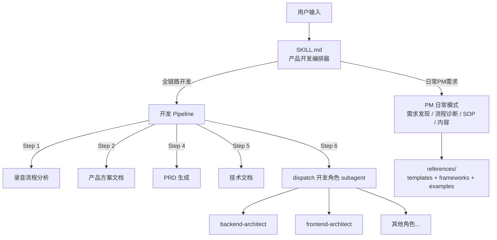

# 产品开发 Skill 固化方案

## 核心思路

将两个来源合并为一个统一 Skill：

- **现有 `ai-product-manager`**：需求发现、流程诊断、SOP 设计、营销内容等日常 PM 能力
- **Aaron 6 步工作流**：访谈录音 -> 流程分析 -> 产品方案 -> PRD -> 技术文档 -> 开发的全链路

合并后的 SKILL.md 同时承担两个职责：
1. **日常 PM 模式** -- 单独讨论流程优化、SOP、内容策略等
2. **全链路开发模式** -- 从访谈录音到可运行 Demo 的完整 pipeline

Subagent 调用机制不变：Skill 文件定义角色 Prompt，通过 Task + generalPurpose subagent 触发。



## 文件结构

位置：`~/.cursor/skills/product-development/`

```
product-development/
├── SKILL.md                          # 合并后的主文件：PM能力 + 开发工作流 + 调用协议
├── context/                          # 迁移自 ai-product-manager
│   ├── README.md
│   └── shokz.md
├── references/                       # 迁移自 ai-product-manager
│   ├── discovery-examples.md         # 追问对话示例
│   ├── templates.md                  # 各模块输出模板
│   ├── frameworks.md                 # 分析框架
│   └── project-patterns.md           # 项目设计参考模式
├── prompts/                          # Aaron 工作流各步骤 Prompt
│   ├── step1-interview-analysis.md   # 录音分析 Prompt
│   ├── step2-product-solution.md     # 产品方案文档 Prompt
│   ├── step4-prd-generation.md       # PRD 生成 Prompt
│   └── step5-tech-doc.md            # 技术文档 Prompt
└── roles/                           # 8 个开发团队角色（PM 已合入 SKILL.md）
    ├── compliance-reviewer.md
    ├── performance-optimizer.md
    ├── devops-engineer.md
    ├── ai-integration-engineer.md
    ├── api-test-engineer.md
    ├── backend-architect.md
    ├── frontend-architect.md
    └── ui-ux-designer.md
```

## SKILL.md 合并策略

SKILL.md 分为四个区块：

**区块 1: 元数据与触发条件**
- `name: product-development`
- `description` 覆盖两类触发词：
  - PM 日常：产品经理、流程优化、SOP、PRD、营销内容、GTM、FABE（来自现有 Skill）
  - 全链路开发：从访谈开始、访谈转产品、产品开发全流程、Aaron 工作流、生成PRD、技术文档（新增）

**区块 2: PM 日常能力**
- 从现有 `ai-product-manager/SKILL.md` 整体迁入：角色定位、业务上下文、需求发现阶段0、任务路由表、通用原则
- 参考资料的链接路径更新为 `references/` 下的新位置

**区块 3: 全链路开发工作流**
- 6 步编排逻辑（来自 Aaron 文档）
- 每步指令：读取 `prompts/*.md` -> dispatch subagent -> 收集输出
- 适配说明：录音转文字稿由用户在外部准备，后续全部在 Cursor 完成

**区块 4: Subagent 调用协议**
- 角色选择规则：根据 PRD 和技术文档的内容，判断需要调用哪些角色
- 调用方式：读取 `roles/*.md` -> 用 Task 工具 dispatch generalPurpose subagent，将角色 Prompt + 具体任务注入
- 并行策略：前后端等独立任务并行 dispatch

## 角色文件写入规则

每个角色文件从 Aaron 原文**完整保留**，不精简能力维度：
- Role、Mission、所有 Aspects（A1-A10 全部保留）、Pattern 区块原样写入
- 去掉 Trae 特有的 UI 元数据（英文识别名称、示例对话格式），这些在 Cursor 中无意义
- 文件顶部加 `trigger:` 字段，标注什么场景下编排器应该调用这个角色

## 迁移与清理

1. 将 `ai-product-manager/` 下的 `context/`、`discovery-examples.md`、`templates.md`、`frameworks.md`、`project-patterns.md` 迁移到新目录
2. `test-prompts.json` 迁移到新目录根（如需保留）
3. 删除旧 `ai-product-manager/` 目录，避免两个 Skill 同时响应"产品经理""PRD"等触发词

## 外部工具适配

- Step 1 前置条件：用户自行用任何工具（千问、讯飞等）完成录音转文字，粘贴到对话中
- Step 2-6：全部在 Cursor 内通过 Skill + subagent 完成
- 原文"切换到某智能体对话框"改为"dispatch Task + 角色 Prompt 注入"
