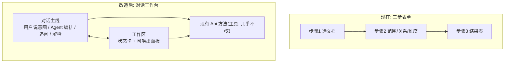
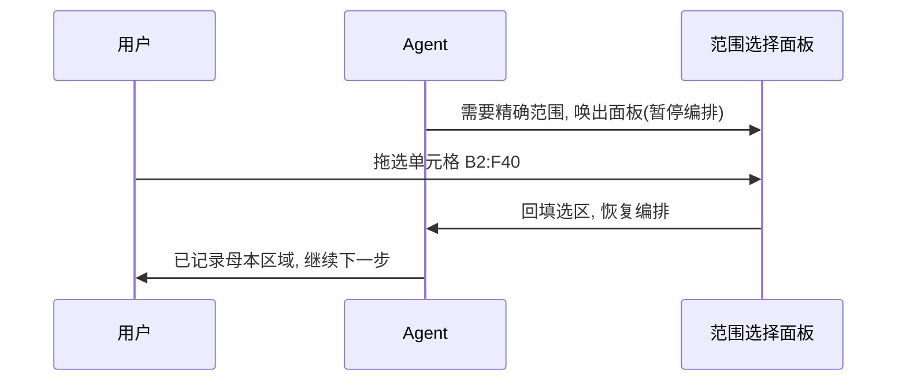

# Agent 对话工作台

把当前"三步表单 + 大模态"重构成"对话工作台"。Agent 当外壳和大脑（对话驱动 + 流程编排 + 结果解释），现有确定性工具不消失，降级为 Agent 按需唤出、用户也能主动点开的精确操作面板。L1 混合架构。

## 主从反转

Agent 接管"流程编排 + 意图理解 + 结果解释"，确定性工具守住"精确执行"（范围像素级拖选、维度勾选、九列结果表）。

## 后端: 现有方法就是工具

`app.py` 里这些方法直接注册成 Agent 可调用的工具，内部逻辑不动：

- 文件与结构: `pick_file` / `list_sheets` / `used_range` / `load_grid`
- 范围: `validate_range` / `preview_range` / `detect_columns`
- 维度: `dimension_catalog`
- 核心: `run_proofread`
- 导出: `export_report`

Agent 维护一份会话状态（baselines / targets / relationship / pairing_mode / enabled_dimensions / materials），通过工具调用逐步填充——等价于现在前端 JS 维护的 state，只是改由 Agent 编排。

## 最难的一块: 唤出面板的挂起/恢复

范围拖选这类操作没法靠对话完成，必须把控制权交给面板。流程：

这是整个方案技术核心：Agent 要支持"发起一个等待用户面板操作的中断 → 前端完成后回填 → 继续 tool-calling 循环"。

## 改动点（文件级）

- 新增 `proofreader/orchestrator.py`：会话状态、把现有 Api 方法描述成 tool schema、跑 tool-calling 循环、决定何时唤出 UI 面板。
- `proofreader/llm_client.py`：增加支持 function calling 的多轮 chat 接口。
- `app.py`：新增 `agent_send(message, attachments)` 对话入口；新增 Agent→前端唤面板、前端→Agent 回填的双向通道（`evaluate_js` + 回调）；现有 Api 方法保留为工具。
- `ui/index.html` + `app.js` + `style.css`：重构为对话工作台布局（左对话流 + 右工作区）。复用现有范围选择大模态、九列结果表组件，触发方式从"点按钮"变成"Agent 唤出 或 用户主动点"。

## 保持不变

`scope.py` / `pairing.py` / `rules.py` / `prompt.py` / `report.py` / `excel_reader.py` 内部逻辑；范围选择器与结果表组件本体；导出与配置持久化（session 结构需同步升级为存对话状态）。

#