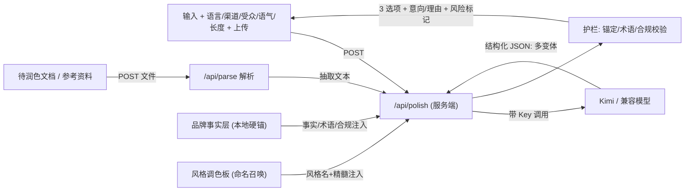

# 品牌文案副驾 启动书

## 一句话定位
不是翻译器,是"品牌文案副驾":翻译式左右分栏只是外壳,内核是**懂韶音腔调、给多个带推理的选项、可控渠道与合规**的文案生成。

## 目标 / 非目标
- **目标**:输入一段原文 → 输出若干个(模型按场景判断)带侧重与理由的品牌化版本;支持跨语言;能吃文档与背景资料;结果像韶音官方写的。
- **非目标(先不做)**:CMS 发布、付费墙、移动 App、海量语料的向量检索。
- **预留不做死**:MVP 先单人本地跑,但**后续可能上线给团队多人用**,所以数据结构与状态从一开始就按"可加持久化、多人、历史"设计,避免返工(留接口,后期升级)。

## 差异化(对比通用翻译/通用 ChatGPT)
- 通用翻译只给"一个对的译文";本工具给**多个由模型按场景判断的策略 + 为什么**,让人做选择而不是接受。
- 内置**韶音品牌事实层 + 风格调色板**,输出带韶音腔调,不是泛泛的好文案。
- 带**护栏**:型号/规格/商标不被乱改、不杜撰卖点、广告法违禁词提示。

## 使用者与场景(决定输入/输出维度)
- 使用者:韶音市场/海外运营/社媒/电商 listing 同学。
- 场景:产品 listing、社媒帖、广告语/headline、EDM、包装与说明文案、PR。
- 关键含义:**不同渠道对语气和长度的要求差异很大**(广告 headline 有字符上限,listing 要卖点密集,社媒要口语),所以"渠道"应成为一个输入维度。

## 输入维度(从"一段文本"扩展)
- 文本输入 + 待润色文档上传(txt/md/docx/pdf)
- 源语言 → 目标语言(含自动识别/保持原语言)
- **渠道/文案类型**:listing / 社媒 / 广告语 / 邮件 / 包装(预设各自的语气与长度倾向)
- **目标市场/受众**:如欧美 / 日本 / 东南亚(影响表达习惯与禁忌)
- **语气滑杆**:克制 ↔ 活泼
- **长度约束**:目标字数/字符上限(广告位常有硬限制)
- **必含关键词 / 禁用词**:卖点词、SEO 词;品牌禁用表达
- **风格调色板(可选)**:前端呈现风格清单供勾选去 nudge;不选则模型自判
- 背景/参考资料上传:品牌调性、产品规格、受众说明(作上下文,不参与翻译)

## 输出维度(从"三段文本"扩展)
- 多个变体(数量与方向由模型按场景判断,通常 2-4 个),每个带 `intent`(意向)+ `reason`(为什么)
- **改动点提示**:相对原文改了什么(让人看懂调整逻辑)
- **字数/字符校验**:对照所选渠道的长度上限给红黄提示
- **跨语言回译核对**:目标语回译一句,提示是否走样(可选)
- **风险标记**:命中广告法绝对化用语 / 健康宣称越界时高亮
- **微调动作**:对某个变体一键"更短 / 更活泼 / 再地道一点"

## 质量与护栏(我判断这是专业度的分水岭)
- **事实锚定**:型号、规格数字、商标(含 ™)、产品名一律不被改写或杜撰;不确定就保留原文并标注。
- **术语一致性**:产品名/卖点术语统一(呼应"不失真"——同一名词跨版本不能漂移)。
- **合规**:中国广告法绝对化用语("最/第一/顶级")提示;韶音是骨传导/开放式耳机,**健康类宣称需谨慎**,越界给警告而非照搬。
- **不编造**:只润色与重组已有信息,缺事实时提示补充,不替品牌发明卖点。

## 语料与风格:两层模型
原则(我的判断):**不本地化模型已经会的东西,只本地化它会瞎编的东西**。文学经典、经典广告模型早已读过,做成本地库既不可行也没必要;真正要本地化的是模型不可靠、会编造的韶音专有信息。

- **Layer 1 品牌事实层(本地、硬锚、要维护)**:只存韶音专有信息——产品名/型号/规格、品牌术语、调性 do/don't、商标规范、合规/禁用表达。来源:抓 shokz.com / shokz.com.cn + 你补充。作用:护栏的事实基础,防幻觉、保品牌一致。结构:`data/brand-facts.json` + 一张品牌调性卡。
- **Layer 2 风格调色板(借模型潜力、不本地化)**:不存全文,只存极小的"命名 + 一句话精髓"清单。模型按名字从自身训练知识里把手艺补全落地。**Apple 在此层作命名参考即可,不必本地抓全文。** 结构:`data/style-palette.json`(name + essence + 可选 1 条极短示例)。

核心:**事实收紧,风格放开**——Layer 1 焊死事实防幻觉,Layer 2 给模型最大创作空间。
调用:**模型自选为主**;前端把调色板呈现为可选项,用户可勾选"想要的味道"去 nudge,不选则模型按输入自判。
合规:仅作内部风格参考,不原样输出他人文案;事实层来源 URL 留痕。

### 风格调色板初稿(我起草,你增删)
- 经典广告手艺:奥格威式论证密度(事实细节堆可信)、DDB 极简幽默(自嘲/留白/反差)、Apple 利益点先行(先说对用户意味着什么、克制留白)、Nike 行动号召(短句/动词/激励)
- 文学修辞味:文学性比喻(一个精准意象顶一堆形容词)、排比递进(节奏层层加码)、古典韵律(对仗/四字格/东方含蓄)
- 语域情绪:口语亲和(像朋友说话/第二人称)、新闻体克制(事实优先/零夸张)、高级感克制(少即是多/不喊口号)

## 数据飞轮(后期增长点)
用户采纳/编辑过的好文案,可回流补进语料库,让输出越用越像团队自己的腔调。MVP 先不做持久化,但 prompt 与数据结构按"可回流"设计。

## 技术选型

- **框架**:Next.js (App Router) + React + TypeScript
- **样式**:Tailwind CSS
- **AI 调用**:`openai` SDK + Kimi/Moonshot 兼容接口。环境变量配置 `baseURL` + `apiKey` + `model`,provider 无关,以后换模型只改配置。Key 只存服务端,前端永不接触。
  - `OPENAI_BASE_URL=https://api.moonshot.cn/v1`
  - `OPENAI_API_KEY=<Kimi key,放 .env.local>`(已在聊天明文暴露,建议后续在控制台重置)
  - `OPENAI_MODEL=<待确认,在 Moonshot 控制台核对当前可用 slug>`
- **文档解析**:`mammoth`(.docx)、`pdf-parse`(.pdf)、原生读取(.txt / .md)

## 整体架构

## 核心数据契约(LLM 返回结构化 JSON)
**方向不写死,交给模型判断。** 每次返回一个变体数组,**由模型根据原文、渠道、目标语言自行决定给哪几个方向、给几个**(建议 2-4 个,且彼此要有明显区分)。常见方向如精准忠实 / 地道自然 / 营销感染只作 prompt 里的"灵感示例",不是强制清单——模型可按场景另起方向(如"更口语""更高级感""更短促有力")。

每个变体字段:`focus`(模型自拟的方向名)、`text`(美化后文案)、`intent`(表达意向)、`reason`(为什么这么改/为什么选这个方向)、`changes`(改动点,可选)、`charCount`、`risks`(命中的合规/风险提示,可选)。
前端按返回的数组**动态渲染卡片数量**,不假设固定为 3。通过 prompt 约束 + `response_format: json` 保证结构稳定可解析;结构按"可回流语料"设计,便于后期把采纳的版本补进语料库。

## 界面布局
- 顶部:源语言 → 目标语言下拉(含"自动识别"和"保持原语言";覆盖 中-中 / 中-英 / 英-英 / 英-中 等)
- 左栏:大文本输入框 + "上传待润色文档"按钮(txt/md/docx/pdf,自动填入文本)
- 左栏:风格调色板(可勾选的风格标签,来自 `style-palette.json`;可不选,留给模型自判)
- 左栏下方:"参考资料/背景"上传区(品牌调性、受众说明等,作为上下文喂给模型,不参与翻译)
- 右栏:动态数量的结果卡片(随模型返回),每张展示 美化文案 + 一键复制 + 可折叠的"意向/理由"
- 一个"美化"主按钮 + loading 态

## 目录结构(计划新建)
- `app/page.tsx` — 主界面(左右分栏 + 语言选择 + 上传)
- `app/api/polish/route.ts` — 调用模型,返回多变体 JSON(数量由模型判断)
- `app/api/parse/route.ts` — 接收上传文件,按格式解析为纯文本
- `lib/llm.ts` — provider 无关的模型客户端封装(Kimi 兼容)
- `lib/prompt.ts` — 构造 system/user prompt(注入语言、背景、品牌事实层、风格调色板)
- `data/brand-facts.json` — 韶音品牌事实层(产品/术语/调性/合规)
- `data/style-palette.json` — 风格调色板(命名 + 一句话精髓)
- `scripts/scrape-corpus.ts` — 抓取/整理韶音事实层的脚本(一次性,可重跑)
- `components/` — InputPanel / ResultCard / LanguageSelector / FileDropzone / StylePalette
- `.env.local.example` — `OPENAI_API_KEY` / `OPENAI_BASE_URL` / `OPENAI_MODEL`
- `README.md` — 启动步骤与如何换模型

## 启动顺序(我建议的节奏)
1. 初始化 Next.js + Tailwind + TypeScript 工程,跑通空白页
2. 搭好左右分栏静态界面(先用假数据填几张卡片,确认交互手感)
3. 抓取 Shokz 官网建 `data/brand-facts.json` + 建 `data/style-palette.json`
4. 实现 `lib/llm.ts` + `/api/polish`,接通 Kimi,返回结构化多变体(数量由模型判断,注入事实层 + 风格调色板)
5. 接入语言选择,把源/目标语言传进 prompt
6. 实现 `/api/parse` + 文件上传(先 txt/md,再 docx/pdf)
7. 接入"背景资料"上传并注入上下文
8. 完善复制、loading、报错、空态等体验细节
9. 写 README,补 `.env.local.example`

## 交付与迭代节奏
不是三个独立项目,是**同一套代码上加东西**。节奏:地基一次打好 → Demo 当验证闸门 → 真实试用归类问题 → 反推下一步。

**MVP = 地基,不是一次性 Demo。** 现在的架构选择就是为后续埋伏笔,后面加功能不返工:
- provider 无关的 `lib/llm.ts` → 换模型不重写
- 变体数量交给模型 + 结构化 JSON → 加字段(改动点/风险)不破坏前端
- 两层语料(事实层 + 风格调色板) → 加内容不动代码
- 数据结构按"可持久化/多人/可回流"设计 → 日后上线多人、接历史不返工

**Demo 的真正职责 = 验证闸门**,回答一个核心问题:模型 + 韶音事实层 + 风格调色板,能不能产出"像韶音写的、事实不错、能直接用"的文案?你拿真实任务去试,把问题归三类——腔调不像 / 事实出错 / 不好用——分别对应调风格、加固护栏、补功能。

**V1/V2 的优先级由 Demo 反推,不照搬清单。** 下面是候选池,每阶段末尾是决策点(继续/调方向),不是锁死范围:
- **MVP(地基)**:左右分栏 + 语言选择 + 文本/文档输入 + 多变体(数量由模型判断,带意向/理由) + 接通 Kimi + 注入事实层与风格调色板。跑通"输入→多选项"主流程,本地运行。
- **V1(可控与可信)**:渠道/受众/语气/长度等输入维度;字数校验、改动点提示、合规违禁词与事实锚定护栏。
- **V2(增长与上线)**:历史/收藏、好文案回流语料、上线部署 + 多人使用(登录与数据隔离)、语料升级为按需检索(RAG)、流式输出、成本与缓存优化。

## 成功度量(怎么算做对了)
- 采纳率:用户最终复制/采用了哪个变体(也反推哪些风格方向最有用)。
- 编辑距离:采用后又改了多少(越少说明越贴需求)。
- 护栏命中:违禁词/越界宣称被拦截的次数(避免合规事故的直接价值)。

## 主要风险与对策
- **官网可达性/改版**:抓取失败 → 优先 `.com.cn`,标记缺口让你补;语料与代码解耦,改版后可单独重抓。
- **模型 JSON 不稳定**:严格 prompt + `response_format` + 解析失败兜底重试/降级展示纯文本。
- **Key 安全**:只存服务端 `.env.local`,已暴露的 key 建议重置。
- **合规误判**:护栏给"提示"不做"硬删",最终由人定夺,避免误杀。
- **成本**:长背景资料按需截断;V2 引入缓存/检索只喂相关片段。

## 需要你后续提供 / 待确认
- Moonshot 控制台当前可用的模型 slug(待确认),其余配置我用 Kimi key 即可跑通。
- 抓取后由你过一遍品牌事实层,确认产品信息与调性提炼准确;风格调色板的命名清单你也可增删。
- 渠道/受众的具体清单(先按我列的预设跑,后续你再增删)。