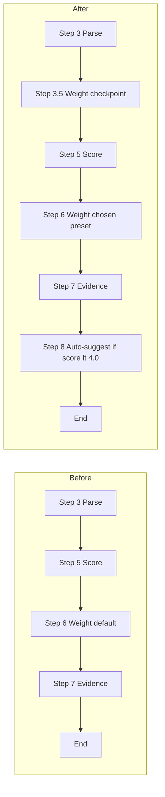

# Shokz Persona Simulator 升级：可调权重 + 自动建议

## 范围（按你确认的 "recommended" + 调研归档 + Target 预设）

1. **权重断点**：展示数据来源 + 询问场景洞察 + 提供预设/自定义（核心需求 1）
2. **低分自动建议**：综合分 < 4.0 时针对最低分人群给改进方向（核心需求 2）
3. **抽出 weight_presets.md**：集中管理预设，新增 Target 渠道预设（共 5 套）
4. **调研文档归档**：把支撑预设的调研报告放进 references/external_research/，作为 fact check 的支撑材料
5. **修 weighted_score.py**：支持 JSON 字符串直接传参，避开 Windows 中文路径报错

## 改动文件清单

| 文件 | 操作 |
|---|---|
| [SKILL.md](c:\Users\016551\.cursor\skills\shokz-persona-simulator\SKILL.md) | 修改：新增 Step 3.5 + Step 8，并在 calculator 段落引用新的预设文件 |
| [references/weight_presets.md](c:\Users\016551\.cursor\skills\shokz-persona-simulator\references\weight_presets.md) | 新建：集中管理 5 套预设（含 Target） |
| references/external_research/costco_user_research.md | 新建：拷贝 Costco 用户画像研究报告 |
| references/external_research/bos_seal_imc_2026.md | 新建：拷贝 26 年 3 月骨导运动线 IMC 信息通 |
| references/external_research/target_user_research.md | 新建：拷贝 Target 客群洞察报告 + 事实校准摘要 |
| [scripts/weighted_score.py](c:\Users\016551\.cursor\skills\shokz-persona-simulator\scripts\weighted_score.py) | 修改：支持 JSON 字符串和 stdin 输入 |

---

## 一、SKILL.md 新增 Step 3.5（权重断点）

在原 Workflow 第 3 步（"Parse the concept"）之后、第 5 步（打分）之前，插入透明化的权重确认环节。

**核心原则**：每个预设选项展示时都必须附带"来源标签"，让用户在做选择时就能区分"调研直接来源"vs"我的判断"，符合 content-integrity 规则。

```markdown
3.5. Surface persona weighting transparently before scoring.

   Step A — 展示数据来源全景:
   告诉用户当前可选的权重方案各自来自哪里，方便用户对照自己的场景选择。
   格式如下:

   | 预设 | 权重 | 数据来源 | 性质 |
   |---|---|---|---|
   | 默认（北美总盘） | 0.218/0.316/0.163/0.303 | 2026 北美品牌用户调研 n=633，k=4 聚类 | 调研直接来源 |
   | Costco 渠道 | 0.15/0.20/0.30/0.35 | Costco 用户画像研究 §1.1（72% female shopper） | 我的判断 |
   | Target 渠道 | 0.13/0.20/0.35/0.32 | Target 客群洞察报告（事实校准版）+ Target style/value 心智 | 我的判断 |
   | BOS DTC 渠道 | 0.25/0.50/0.05/0.20 | 26 年 3 月 IMC 信息通（BOS 77% 运动标签） | 我的判断 |
   | SEAL 游泳人群 | 0.20/0.35/0.15/0.30 | 26 年 3 月 IMC 信息通（SEAL 性别均衡） | 我的判断 |
   | 自定义 | — | 用户输入，sum = 1.00 ± 0.05 | 用户判断 |

   Step B — 询问场景洞察:
   Ask: "你这次评估的场景是？如果以上预设不匹配，请描述你的目标人群，
   我会帮你推荐或自定义权重。"

   Step C — 处理用户响应:
   - 选中预设: 使用对应权重，最终报告中 cite 该预设的数据来源.
   - 自定义: 校验和并 normalize, 在报告中标注 "weights provided by user".
   - 描述具体场景但没选预设: 我根据描述映射到最近的预设, 或建议自定义.
   - 不响应: 使用默认权重并在报告中标注 "using default weights (Shokz 北美总盘)".

   Step D — 在最终报告中 cite 所用权重的数据来源:
   报告头部标注: "本次评估使用 [预设名] 权重，来源: [数据来源]。"
   非调研直接来源的预设额外标注: "本预设为我的判断，非调研直接结论。"
```

**关键设计**：

1. **不强制必选**：默认权重仍是 fallback，但必须先 surface 全景表
2. **来源前置展示**：用户在做选择时就能看到"调研直接来源 vs 我的判断"，符合 content-integrity 规则
3. **报告内 cite 自动化**：所选权重的来源会被自动写入最终报告头部，让读者也知道权重的可信度
4. **支持场景描述**：用户可以不选预设，直接描述目标人群（如"我评估的是 Hispanic 女性"），由 LLM 协助映射或自定义

## 二、SKILL.md 新增 Step 8（低分自动建议）

在原 Workflow 第 7 步（添加证据）之后，追加优化输出环节：

```markdown
8. Provide improvement suggestions if weighted_score < 4.0.
   - Identify the lowest-scoring persona.
   - Cross-reference its Concept Reaction Heuristics in personas.md.
   - Suggest 2-3 specific rewrites with concrete examples.
     例如: "为科技老白男补一个可量化 proof point（如 '27g' / '9hr battery'）"
   - 标注每条建议的预期分数变化（如 "+0.3 expected"）作为 my judgment.
   - 标注为 "我的判断" per content-integrity rule.
```

**关键设计**：触发条件 4.0 是 hard threshold；最低分人群优先（因为权重再低也是基本盘的一部分，不能放弃）。

## 三、新建 references/weight_presets.md

集中管理所有预设权重，并把每个预设背后的完整推理链作为 audit trail 沉淀下来。这样当源数据变化（如 Costco 女性占比从 72% 变成 80%）时，可以按"修改 checklist"快速判断哪些预设需要重算。

**每个预设包含 5 个模块**：

1. **权重数字**（4 个值 + sum 校验）
2. **数据来源**（具体引用哪份文档的哪一节 + 原文摘录）
3. **推理过程**（观察 → 调权方向 → 每个人群的调权幅度和理由）
4. **关键假设**（这个预设依赖哪些假设，未来怎么 check）
5. **修改 checklist**（什么情况下需要重新计算）

完整骨架以 "Costco 渠道" 为例：

```markdown
## Costco 渠道（女性主力购物者偏多）

### 权重
| Persona | Weight | vs Default |
|---|---|---|
| 科技老白男 | 0.15 | -6.8 pp |
| 骨传导跑男 | 0.20 | -11.6 pp |
| 日常颜值派 | 0.30 | +13.7 pp |
| 日常开放派 | 0.35 | +4.7 pp |
| Sum | 1.00 | ✓ |

### 数据来源（原文摘录）
- 来源 1: Costco 用户画像研究报告 §1.1
- 原文: "Most Costco shoppers are women, making up 72% of the customers.
  Whereas men make up the remaining 27% of the shoppers."
- 引用: GrabOn 2026 Costco Statistics, CouponZania 2026

### 性质
我的判断（基于已发布调研做的二次推断，非调研直接结论）

### 推理过程
1. 观察: Shokz 现有用户调研 56% 男性 vs Costco 到店 72% 女性 → 显著错配
2. 调权方向: 上调女性人群（日常颜值/开放派）, 下调男性人群（科技老白男/骨传导跑男）
3. 每个人群的调权理由:
   - 科技老白男 21.8% → 15%: 男性 + 重技术参数, Costco 渠道决策权较弱
   - 骨传导跑男 31.6% → 20%: 最大男性偏移, Costco 不是其主要购买渠道（多通过 Amazon/DTC）
   - 日常颜值派 16.3% → 30%: 74% 女性人群, Costco 主力匹配度最高
   - 日常开放派 30.3% → 35%: 99% 女性, 但已是较高基线, 边际上调

### 关键假设
- Costco 到店购物者中, 主决策者 = 购物者本人（即耳机使用者就是结账者）
- 72% 女性数字保持稳定（如未来调研显示变化超过 5 pp, 需要重算）
- 男性人群（科技老白男 + 骨传导跑男）在 Costco 渠道购买耳机的转化率显著低于在 Amazon/DTC

### 修改 checklist
出现以下任一情况需要重新计算本预设:
- [ ] Costco 女性购物者占比变化超过 5 pp
- [ ] Costco 推出新会员结构（如企业会员、学生卡）显著改变人群组成
- [ ] Shokz 在 Costco 上架主打男性的 SKU（如纯运动型 BOS）
- [ ] 出现更新的 Shokz × Costco 渠道用户画像调研
```

其他三套预设（默认 / BOS DTC / SEAL 游泳）按同样 5 模块结构展开。Default 因为是调研直接来源，"性质"段标注 "调研直接来源"，"推理过程" 段简化为聚类方法描述。

**关键设计**：

1. **完整 audit trail**：每个权重数字都能追溯到具体原文 + 推理过程，不存在"黑箱权重"
2. **修改 checklist 显性化**：未来想改某个预设时，先 check 这个清单，确认是数据真的变了还是判断需要更新
3. **vs Default 列**：每个预设都明示相对默认的调权方向和幅度，便于横向对比
4. **关键假设独立成段**：把"我建立这个权重时依赖了哪些假设"明文写出，未来挑战权重时可以挑战假设而不是数字

## 四、Target 文档事实校准与预设权重设计

**Target 原文档自带的校准（章节十三）已识别**：
- **事实层**：Target 品牌定位（style/value/convenience）、Target Circle 会员体系、Target 客群偏中等及以上收入 + 城市/郊区并重 —— 这些有官方/第三方公开数据支持
- **创作推定**：三个 persona（晨跑白领 / 生活平衡家长 / 风格城市跑者）、年龄/收入区间、persona 到 Slogan 的映射 —— 这些是基于公开定位 + 品类需求的二次推断，不是 Target 官方分群

**追加校准（我做的二次校准）**：

| 维度 | Target 文档原文 | 校准结论 | 用于权重推导 |
|---|---|---|---|
| Target 客群性别 | "Persona 2 女性略高""Persona 3 女性稍高" | 我的判断：Target 偏女但不如 Costco 极端（Costco 72%，Target 估约 60%） | 上调女性人群权重，但幅度小于 Costco 预设 |
| Target 客群年龄 | persona 覆盖 22-45 岁 | 比 Costco 35-55 主力更年轻 | 略下调"年长偏好"暗示，不直接影响 4 persona 权重 |
| Target 调性 | 不喜竞技压迫感，喜 "achievable lifestyle" | 与"骨传导跑男"（运动硬核）调性错位明显 | 下调骨传导跑男权重 |
| Target 客群审美 | 看重 style + value + 设计感 | 高度匹配"日常颜值派"（设计/家务/通勤） | 显著上调日常颜值派权重 |

**Target 渠道预设权重推导**（我的判断）：

| Persona | 默认 | Target 预设 | vs Default | 调权理由 |
|---|---|---|---|---|
| 科技老白男 | 0.218 | **0.13** | -8.8 pp | Target 客群"不喜技术堆砌、喜生活升级"，与科技老白男的 spec-driven 取向错位最严重 |
| 骨传导跑男 | 0.316 | **0.20** | -11.6 pp | Target 调性"自律但不苦行"与硬核运动取向错位；但 Persona 3 风格型城市跑者仍有部分骨传导跑男特征 |
| 日常颜值派 | 0.163 | **0.35** | +18.7 pp | Target style/value 心智 + Persona 1（晨跑白领，女性审美）+ Persona 3（风格城市跑者）双重覆盖，匹配度最高 |
| 日常开放派 | 0.303 | **0.32** | +1.7 pp | Persona 2 生活平衡家长（家庭采购、99% 女、家务/工作）高度匹配，但 Target 整体偏年轻使其上调幅度小于 Costco |
| Sum | 1.000 | **1.00** | ✓ | |

**关键假设**：
- Target 三个 persona 是创作推定，"基于推定的推定"风险高于 Costco 预设（Costco 至少有 72% 女这个硬数据）
- Target 客群比 Costco 更年轻、性别偏向更弱、style 心智更强
- 将来若有 Target × 耳机品类的真实调研，本预设需要整体重算

**修改 checklist**：
- [ ] Target 发布新的客群结构数据（如新会员或新区域大幅扩张）
- [ ] Shokz 进入 Target 后产生真实的用户调研（首选触发条件）
- [ ] Target persona 文档本身被更新或修正

## 五、新建 references/external_research/ 子目录（调研文档归档）

把支撑预设的调研报告归档进 skill 的 references/external_research/ 子目录，作为 fact check 的支撑材料。

```
references/
├── personas.md                          [既有] Shokz 调研 633 人画像
├── core_research_findings.md            [既有] Shokz 调研 633 人统计
├── weight_presets.md                    [新建] 5 套预设的完整推理（含 Target）
└── external_research/                   [新建子目录]
    ├── costco_user_research.md          [拷贝自项目目录]
    ├── bos_seal_imc_2026.md             [拷贝自项目目录]
    └── target_user_research.md          [拷贝 + 事实校准摘要前置]
```

**归档原则**：
- 文件**拷贝**而非软链接——skill 是独立单元，不应依赖项目目录路径
- 每份文档头部新增"事实校准摘要"区块，明确标出"事实层"和"创作层"
- weight_presets.md 中的每个预设 cite 这些归档文档时使用相对路径 `external_research/xxx.md`

**Target 文档归档时的事实校准摘要前置**（示例）：

```markdown
# Target 客群洞察报告（事实校准版）

## ⚠️ 阅读须知：事实层 vs 创作层

### 事实层（可用作权重推导依据）
- Target 品牌定位为 style/value/convenience（官方 2024 Annual Report）
- Target Circle 会员体系（官方）
- Target 客群偏中等及以上收入 + 城市/郊区并重（第三方公开零售数据）

### 创作层（仅供权重推导参考，不可对外引用）
- 三个 persona（晨跑白领 / 生活平衡家长 / 风格城市跑者）
- 年龄/收入区间
- persona 到 Slogan 风格的映射

[原文档内容...]
```

## 六、修 weighted_score.py 编码 bug

**当前问题**：脚本把 `argv[1]` 直接当文件路径用 `Path.read_text` 读取，传 JSON 字符串时报 `OSError [Errno 22]`（Windows 中文环境下尤其频繁）。

**改造方案**：先尝试解析为 JSON 字符串，失败再当文件路径，并新增 stdin 模式：

```python
def load_payload():
    if len(sys.argv) > 1:
        arg = sys.argv[1]
        try:
            return json.loads(arg)  # JSON 字符串
        except json.JSONDecodeError:
            return json.loads(Path(arg).read_text(encoding="utf-8-sig"))  # 文件路径
    else:
        return json.loads(sys.stdin.read())  # stdin
```

修复后支持三种调用方式，绕开 Windows 中文路径的编码地雷。

---

## 改造前后对比



## 验证方式

完成后跑一遍今天的 OpenTri Slogan 评估流程验证：
- Step 3.5 能正确触发"你评估的是什么场景？"问题
- 选 Costco 预设后权重确实切换为 0.15/0.20/0.30/0.35
- 给一个低分 slogan，Step 8 能给出针对性的改进建议
- `python weighted_score.py '{"scores": {...}}'` 在 Windows 终端不再报错
