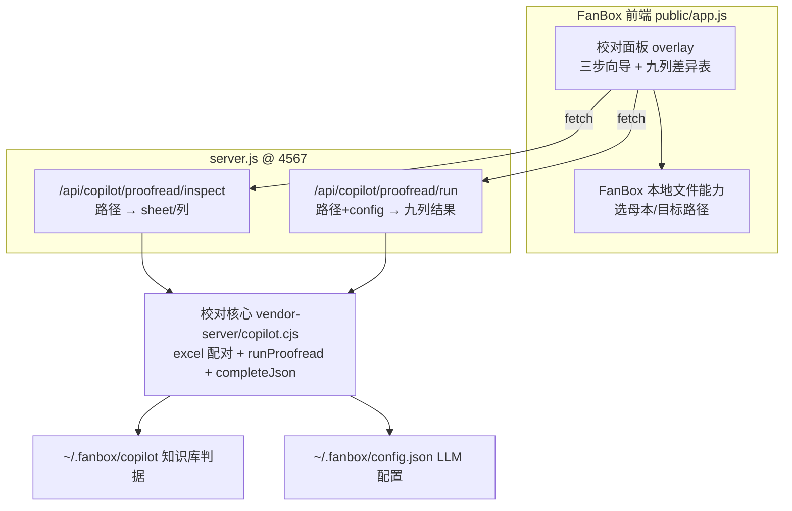

# 校对功能深度融合进 FanBox

先做一个垂直切片：把 copilot 现有的 Excel 校对原样深度融合进 FanBox，跑通、测试。不抽能力层、不做两张脸、不接对话 agent——那些等这一刀验证完再谈。

## 切片范围

## 关键决策

- 原样复用校对核心：搬 copilot 的 `lib/tools/excel.ts`、`proofread.ts`、`types.ts`、`lib/kb/store.ts + types.ts`，配对与提示词逻辑不改，打成 CommonJS。
- 不嵌独立 LLM 客户端，全盘走 FanBox 的 LLM 通道：原 `lib/llm.ts` 的 `completeJson` 基于 `openai` SDK + 独立 `config.local.json`，本切片去掉 SDK，把 `completeJson` 改写成用 `fetch` 调 FanBox 配置（`~/.fanbox/config.json` 的 `chatApiBaseUrl / chatApiKey / chatApiModel`）的 `/chat/completions`（加 `response_format: json_object`，非流式，解析 JSON）。key/baseURL/model 全用 FanBox 那一份；不再需要 `settings.ts` / `openai`。
- 说明：校对要的是「一次性拿回结构化 JSON」，只能走 FanBox 的程序化 LLM 通道（`chatApi` 同款 fetch），不走终端 CLI agent（PTY 交互、输出非结构化，不可靠）。
- 深度融合点——文件走本地路径，不走上传：FanBox 是本地应用，用它的文件能力选路径，端点按路径 `fs.readFile` 再喂给 `runProofread`（校对核心本就支持 Buffer 入参）。这样请求体是 JSON，套进 FanBox 现有 `readBody`，不用处理 multipart。
- 知识库落在 `~/.fanbox/copilot`：首启把 copilot 的 `data/knowledge-base.json` seed 过去，`runProofread` 读它当判据。本切片不做知识库编辑 UI。
- 打包用 esbuild（FanBox 现有 devDep）把上述逻辑 + `xlsx` 打成一个 `vendor-server/copilot.cjs` 供 `server.js` `require`（不再 bundle `openai`）。
- 不在本切片：能力层抽象、CLI/skill 脸、对话 agent 接入、营销工具、electron-builder 打包（开发期 `npm run app` 跑通即可）。

## 后续（验证通过后再做，不属于本切片）

- 把校对核心抽成 agent 无关的「能力层」，对外加 CLI/skill 脸，让终端里的 Claude/Codex 也能调。
- 应用内对话 agent 接入（tool-calling 或复用 copilot `runAgent`）。
- 其它文档处理能力、知识库管理页、营销功能。
- Windows 安装包（补 electron-builder win target）。

## 实施步骤

### slice0 — 打包校对核心

- 把 copilot 的 `lib/tools/{excel,proofread,types}.ts`、`lib/kb/{store,types}.ts` 与 `data/knowledge-base.json` 纳入 FanBox（如 `copilot-src/`）。
- 改写 `completeJson`：去掉 `openai` SDK，改用 `fetch` 调 FanBox 配置（`~/.fanbox/config.json` 的 `chatApiBaseUrl/Key/Model`）的 `/chat/completions`，`response_format: json_object`，非流式，解析返回 JSON。`proofread.ts` 仍 `import { completeJson }`，签名不变。
- `kb/store.ts` 的 `DATA_DIR` 指向 `~/.fanbox/copilot`，首启 seed `knowledge-base.json`。
- 新增 `src-vendor/copilot-entry.ts` 导出 `runProofread / listSheets / readWorkbook`；加 `build:copilot` 脚本用 esbuild 打成 `vendor-server/copilot.cjs`（bundle `xlsx`，不含 `openai`）。
- 验证：`node -e "require('./vendor-server/copilot.cjs')"` 加载成功。

### slice1 — server.js 两个端点

- `POST /api/copilot/proofread/inspect`：body `{ path }` → `listSheets(readWorkbook(fs.readFileSync(path)))` → `{ sheets }`。
- `POST /api/copilot/proofread/run`：body `{ baselinePath, targetPath, config }` → 读两文件 Buffer → `runProofread(...)` → 结果 JSON。
- 复用 `readBody / sendJSON`；路径安全用 FanBox 现有 `resolvePath`；LLM 调用读 FanBox config。
- 验证：curl 两个端点拿到 sheets 与九列结果。

### slice2 — 前端校对面板

- `index.html` 加入口按钮 + 一个 `copilot-proofread` overlay（参考 `#btn-chat` 与 chat overlay）。
- `app.js` 加模块：三步向导（选文件→配置 sheet/配对/维度/关系→九列差异表）。文件选择走 FanBox 本地文件能力拿路径（不上传），调 inspect/run。
- 九列差异表用 FanBox 风格渲染（参考 copilot 的 `ProofreadCanvas` 列结构）。

### slice3 — 端到端测试

- `npm run app`，在 FanBox 设置里填好 LLM key（校对直接复用这份配置）。
- 准备两个真实 Excel（母本/目标），跑出九列差异表；确认知识库术语/合规作判据生效。
- 出问题就地修，记录卡点。

## 主要风险

- `completeJson` 改 fetch 后，FanBox config 指向的模型必须支持 `response_format: json_object`，否则需降级为「提示词强约束 + 容错解析」；slice0 验证时确认。
- 路径制读文件涉及安全边界，复用 FanBox 现有 `resolvePath` / 回环限制，别新开任意路径读取口子。
- 校对调 LLM 单次最长可能数十秒，server.js 端点不要套死超时；前端给 busy 态。
- 这是测试切片，目标是「跑通 + 暴露问题」，不是定稿；验证完再决定要不要往能力层/两张脸推。

