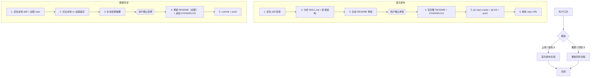
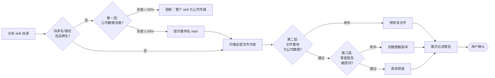

# skill-publisher 开发方案

## 产品定位

一个 Cursor Skill，让用户说"上传 X skill"或"更新 X skill"即可完成：创建 GitHub repo、推送全部文件、生成标准化 README、维护 CHANGELOG。

## 两条核心流程



## 关键设计决策

### 1. Skill 目录定位

按优先级搜索：
- `~/.cursor/skills/{name}/SKILL.md`
- `~/.claude/skills/{name}/SKILL.md`
- 用户指定的绝对路径

### 2. README 生成策略

AI 分析 SKILL.md 内容 + 目录树，按以下固定结构生成（参考 darwin-skill 的 README 质量标准）：

- **标题 + 一句话描述**（从 SKILL.md frontmatter 提取）
- **Badges**（Agent Skill Compatible、License）
- **安装方式**（如何拷贝到 `~/.cursor/skills/`）
- **核心功能**（从 SKILL.md 的触发词和描述提炼）
- **架构 / 流程图**（如果 SKILL.md 中有 mermaid 图则复用，否则从流程描述生成）
- **目录结构**（自动生成 tree）
- **使用示例**（从触发词构造 2-3 个口令示例）
- **配置说明**（如果 skill 有 context/ 或 config 文件）
- **迭代记录**（链接到 CHANGELOG.md）

### 3. CHANGELOG 格式

```markdown
# Changelog

## [1.0.0] - 2026-05-28
### Added
- 首次发布，包含 [功能列表]

## [1.0.1] - 2026-06-xx
### Changed
- [从 diff 提取的变更摘要]
```

遵循 [Keep a Changelog](https://keepachangelog.com/) 格式。

### 4. Repo 命名约定

默认 `{skill-name}`（即 skill 目录名），用户可在确认骨架时修改。GitHub 帐号固定为当前 `gh` 认证帐号（`dantezeng001-glitch`）。

### 5. 保密过滤（硬规则）

上传前必须执行三层保密过滤，任何一层命中即处理，不可跳过。

**第一层：Skill 级别分析（名字含品牌名时触发）**

Skill 目录名或 SKILL.md description 中包含公司品牌名时，扫描全部文件，计算"公司数据浓度"（命中敏感关键词的文件数 / 总文件数）：

- **浓度 > 50%**（多数文件含公司专属数据）→ 阻断上传，告知原因。脱敏后 skill 丧失核心价值，上传无意义。
- **浓度 ≤ 50%**（通用 skill 碰巧引用了公司名）→ 提示重命名 repo，继续走第二、三层过滤。

示例判定：
- `shokz-persona-simulator`：13/14 文件含 Shokz 调研数据、画像、权重 → 浓度 ~93% → **阻断**
- `dante-shokz-ppt`：品牌色板、Shokz 示例贯穿全部资源 → 浓度 ~90% → **阻断**
- `dante-website-product-ui`：设计系统绑定 Shokz 产品线 → 浓度高 → **阻断**
- `product-development`：仅 `context/shokz.md` + 2 处零星引用 → 浓度 ~19% → **重命名 + 过滤**

**第二层：文件级别排除**

扫描 skill 目录下所有文件内容，命中敏感关键词的文件自动排除，不上传。排除清单在确认骨架时展示给用户审核。

示例：`product-development/context/shokz.md` → 整个文件排除。

**第三层：内容级别脱敏**

文件内零星提及敏感关键词（如 SKILL.md 业务上下文表格中的一行 Shokz 引用）→ 创建脱敏副本用于上传：
- 品牌名 → `[YourCompany]`
- 产品名 → `[ProductA]`、`[ProductB]`…
- 人名 → `[Name]`
- 保留文件其余内容不变

脱敏副本写入临时目录（`.skill-publisher-staging/`），push 后清理。**本地原文件永远不改动。**

**敏感关键词注册表**

存放在 [`~/.cursor/skills/github-skill-publisher/sensitive-keywords.yml`]：

```yaml
# 品牌名（大小写不敏感）
brands:
  - Shokz
  - 韶音

# 产品系列名（精确匹配）
products:
  - OpenRun
  - OpenFit
  - OpenSwim
  - OpenComm
  - OpenDots
  - OpenMove
  - OpenMeet
  - OpenHear
  - RoadWave
  - "Shokz Loop"

# 通配排除模式（文件路径匹配，命中则整个文件排除）
file_patterns:
  - "context/shokz*"
  - "**/brand-spec*"
```

用户可随时编辑此文件添加新关键词。Skill 执行时首先读取此注册表。

运行时产出（`node_modules/`、`*.bak.*`、`*.tmp`、`.DS_Store`、`Thumbs.db`、`__pycache__/`、`result-card-*.html`、`*.tsv`）不在此注册表中管理，由首次发布时自动生成的 `.gitignore` 独立处理。

**保密过滤在流程中的位置**



过滤在"分析 SKILL.md + 目录结构"步骤完成后、"生成 README 骨架"之前执行。README 基于脱敏后的内容生成。

### 6. 交互式确认节点

和 product-development 一样，关键步骤暂停等用户确认：
- 首次发布：README 骨架确认（10 行以内，列出章节 + 一句话摘要）
- 更新同步：变更摘要确认（列出改了什么、CHANGELOG 新增条目预览）

## 交付物

全部放在 [`~/.cursor/skills/github-skill-publisher/`](C:\Users\016551\.cursor\skills\github-skill-publisher\)：

- `SKILL.md` — 主指令文件（两条流程 + 三层保密过滤 + README 生成规则 + CHANGELOG 格式 + 异常处理）
- `sensitive-keywords.yml` — 敏感关键词注册表（品牌名、产品名、文件路径通配）
- `templates/README-skeleton.md` — README 骨架模板（占位符版，AI 填充用）
- `templates/CHANGELOG-init.md` — CHANGELOG 初始模板

不需要额外的 prompts/ 或 roles/ 目录——单 agent 执行即可。

## 首次测试：发布 product-development skill

skill 开发完成后，立即执行"上传 product-development skill"完成端到端验证。

**预期过滤结果**（16 个文件）：

- 第一层（重命名检查）：通过——目录名 `product-development` 不含品牌名，无需重命名
- 第二层（文件排除）：`context/shokz.md` 被排除（整个文件是 Shokz 业务数据）
- 第三层（内容脱敏）：`SKILL.md` 和 `context/README.md` 中的 Shokz 引用被替换为 `[YourCompany]`

**最终上传**：15 个文件（排除 1 个），其中 2 个文件使用脱敏副本。

测试流程：
1. 执行保密过滤，展示过滤报告 → 用户确认
2. 基于脱敏内容生成 README 骨架 → 用户确认
3. 写完整 README（含流程图、目录树、使用示例）+ CHANGELOG v1.0.0
4. 创建 GitHub repo `product-development` → push
5. 返回 repo URL

## 和 product-development pipeline 的关系

这个项目**借用了 pipeline 的路径 B 需求引导**（已完成），但后续不走 Step 2-6 全流程。原因：
- 交付物是 Skill（SKILL.md + 模板），不是软件产品
- 没有 backend/frontend 代码需要多角色协作
- 直接进入 SKILL.md 编写 = 等价于 pipeline 的 Step 6，只是产出物不同

## 风险点

- **大 skill 目录的上传体验**：darwin-skill 有 25 个文件含 SVG/HTML 等二进制资源，git push 可能较慢。处理方式：SKILL.md 中加大文件提醒逻辑。
- **README 生成质量**：不同 skill 结构差异大。处理方式：骨架确认环节让用户把关，不自动发布。
- **已有 README 冲突**：darwin-skill 已有手写 README。处理方式：检测到已有 README 时询问是覆盖、合并还是跳过。
