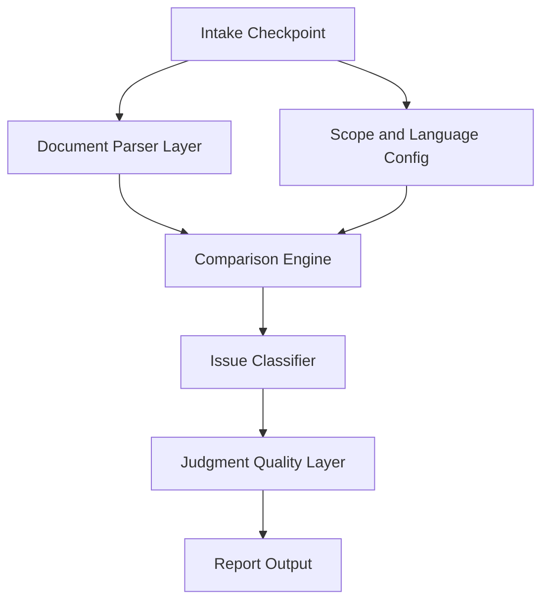

# Packaging Copy Proofreader 普适化改造方案

## 改造核心：三层解耦

当前 skill 的判断逻辑、文件解析、语言检测三件事耦合在一起。改造后拆成独立层：



判断质量层是本轮新增的核心：在分类之后、输出之前，统一做聚类去重、证据溯源校验、置信度评估。

---

## 一、Issue Classifier 重构：从 11 个硬编码类型到 5 维通用模型

当前 11 种 issue type 本质上可以归入 5 个判断维度，每个维度下再细分严重度。这样任何领域的校对都能映射进来：

| 维度 | 含义 | 当前 issue types 归入 |
|---|---|---|
| **Accuracy** | 目标与基准的事实性偏差 | 产品事实不一致、参数不一致 |
| **Sync** | 基准已更新但目标未同步 | 源文案未同步 |
| **Consistency** | 同一文件/项目内部术语/格式不统一 | 术语不统一 |
| **Tone** | 事实正确但表达风格/强度/颗粒度有差异 | 风格差异、表达强度差异、信息颗粒度差异 |
| **Scope** | 目标内容超出已确认基准范围，或基准自身矛盾 | 不在本轮基准范围、基准冲突、语境差异、需确认 |

改动方式：
- `SKILL.md` 的 Issue types 章节改为 5 维模型 + 每维度下的子类型示例
- `references/proofreading-rules.md` 的 Core finding categories 对应重构
- 保留向后兼容：在 `references/` 新增 `domain-presets/packaging.md` 放包装领域专属子类型映射，用户做包装校对时自动加载

---

## 二、Document Parser Layer：去 Excel 中心化

当前限制：`extract_workbook_outline.py` 只处理 xlsx，SKILL.md 的 workflow 围绕"sheet / row / column"展开。

改造策略：

1. **SKILL.md workflow 用通用术语**：用 `section / location / unit` 替代 `sheet / row / column`，仅在具体文件类型时才映射到对应概念
2. **保留 Excel 脚本**，同时在 `scripts/` 下补充通用提示，让 AI 知道如何处理不同格式：

| 文件类型 | 定位单位 | 解析策略（写在 SKILL.md 里，不是新脚本） |
|---|---|---|
| Excel | sheet + row + column | 用 `extract_workbook_outline.py` |
| PDF | page + area/paragraph | 用渲染页面做视觉定位；解析文本做内容比对 |
| Word/DOCX | heading + paragraph | 按标题层级做 section 拆分 |
| Markdown | heading + line range | 直接按 heading 层级映射 |
| 网页/HTML | section + selector | 按语义区块（header/hero/footer）定位 |
| 纯文本 | line range | 按行号 |

3. **Report 表格的 `Sheet/页面` 列改名为 `位置`**，内容根据文件类型填不同的定位信息

---

## 三、Language/Scope Config：去语言对硬编码

当前限制：`tag_header()` 函数和 proofreading-rules 里硬编码了中/英/法/北美关键词。

改造：

1. **Intake Checkpoint 增加一问**：源语言和目标语言（或"同语言不同版本"），不再预设
2. **`proofreading-rules.md` 的 Column and location detection 章节**改为：
   - 通用原则：用户告诉你哪些是 source、哪些是 target
   - 如果用户没指定，提供自动检测的 fallback（保留现有关键词作为 hint，但标注为"启发式建议，非强制"）
3. **Python 脚本保持不动**（它只是输出 tags，不做判断），但 SKILL.md 里说明 tags 只是 hint

---

## 四、Intake Checkpoint 扩展

当前 4 项确认不够覆盖通用场景。改为 5 项：

1. **Baseline master**（母本文件/文档）
2. **Baseline location and limits**（精确位置/范围）
3. **Source-target relationship**（源和目标之间的关系：翻译？同语言不同版本？规范 vs 实施？原稿 vs 缩写版？）
4. **Target content**（目标文件）
5. **Batch mode**（多文件时的处理方式）

第 3 项是新增的，决定了后续用哪套判断逻辑。

---

## 五、Domain Presets 机制

在 `references/` 下新增 `domain-presets/` 目录：

- `packaging.md` — 包装文案领域的专属规则（当前 proofreading-rules 里包装相关的内容下沉到这里）
- 未来可扩展：`localization.md`、`legal.md`、`ecommerce.md` 等

SKILL.md 里增加一条规则：
> 如果用户的场景明确属于某个领域（如包装、本地化、法律），自动加载对应 domain preset 作为判断补充。如果没有匹配的 preset，仅用 5 维通用模型判断。

---

## 六、Report Template 改造

- 表头从 9 列泛化为：`| 文件 | 位置 | 原文 | 建议 | 维度 | 子类型 | 严重度 | 置信度 | 依据 |`（9 列，新增置信度列）
- `位置` 列内容自适应文件类型（Excel 写 "Sheet X / Row Y / Col Z"，PDF 写 "Page 3 / Para 2"）
- `依据` 列必须是基准原文片段引用（见第七节）
- 示例从 Shokz 包装案例改为 2-3 个不同领域的示例（包装 + 软件本地化 + 法律文档各一条）

---

## 七、判断质量层（本轮核心增量）

在 Issue Classifier 之后加一个统一的质量处理层，解决 AI 校对的三个实战痛点：噪音多、误报多、确定性不透明。

### 7.1 发现项聚类去重

当前逐行报告。同一问题（如术语混用）出现在多个位置会列成多行，淹没重点。

改为按"问题指纹"聚合：相同维度 + 相同子类型 + 相同根因 = 一条 finding + 受影响位置列表。

```
术语不统一：earbuds / earphones 混用
受影响位置：包装正面 row7、说明书 p3、app 卡 row12（共 8 处）
```

写入位置：`SKILL.md` 的 output contract 增加聚类规则；`proofreading-rules.md` 增加"问题指纹"定义（哪些字段相同才算同一条）。

### 7.2 证据强制溯源（控 false positive）

当前"依据"列是自由文本，可空泛。改为硬约束：

- 每条 finding 的"依据"必须引用基准的**精确原文片段 + 位置**
- 引用不出基准原文的，不允许直接判错，**自动降级为 `需确认`**
- 与环境内 `content-integrity` 规则一致：可以提判断，不得制造规范

写入位置：`proofreading-rules.md` 的 Reporting discipline 章节加溯源强制条款；`SKILL.md` 的 non-negotiable defaults 加一条。

### 7.3 判断置信度分级

把"严重度"和"置信度"拆成两个独立维度：

- **严重度**：如果这条是错的，后果多大（高/中/低/可接受差异）—— 已有
- **置信度**：我有多确定它真的是问题（高/中/低）—— 新增

用户可快速过滤"高危但低置信"的项做人工复核，避免被误报带偏。

写入位置：`report-template.md` 表头加置信度列；`proofreading-rules.md` 加置信度判定标准（什么情况算高/中/低置信）。

---

## 八、文件改动清单

| 文件 | 动作 | 改动量 |
|---|---|---|
| `SKILL.md` | 重写 | description、non-negotiable defaults（加溯源条款）、intake、workflow、issue types、output contract（加聚类规则） |
| `references/proofreading-rules.md` | 重写 | 5 维模型替代 11 类型、去语言硬编码、去 Product Info/SPEC 残留、问题指纹定义、溯源强制、置信度标准 |
| `references/report-template.md` | 改写 | 新表头（含置信度列）、多领域示例、聚类摘要格式 |
| `references/domain-presets/packaging.md` | 新建 | 从当前 rules 里抽出包装专属逻辑 |
| `evals/evals.json` | 新建 | 6-8 条回归测试用例 |
| `scripts/extract_workbook_outline.py` | 不动 | 保持原样 |
| `agents/openai.yaml` | 小改 | 更新 description |
| `assets/icon.svg` | 不动 | — |

---

## 九、evals 回归测试集

新建 `evals/evals.json`，结构对齐环境内 `pricing` skill 的格式（每条含 `prompt` / `expected_output` / `assertions`）。结构大改后用它锁定回归基线，负例（"不该做什么"）是防退化的核心。

计划覆盖的用例：

| # | 类型 | 验证点 |
|---|---|---|
| 1 | Accuracy 正例 | 参数不一致（如 25h vs 27h）能被抓出 |
| 2 | Sync 正例 | 母本已改、目标未同步能识别 |
| 3 | Scope 负例 | 目标超出母本范围时暂停询问，不硬判错 |
| 4 | 溯源负例 | 引用不出母本原文时降级为"需确认"（验证 7.2） |
| 5 | 聚类用例 | 同一错误多处出现时聚成一条带位置列表（验证 7.1） |
| 6 | Intake 用例 | 母本不明确时先确认 5 项再动手 |
| 7 | 置信度用例 | 高危低置信项被正确标注，不一刀切"中置信"（验证 7.3） |
| 8 | 跨领域用例 | 非包装场景（如软件本地化）能用 5 维模型处理，不强套包装子类型 |

局限：evals 不自动运行，需人工对照 prompt 核验或后续接脚本批量跑。

---

## 十、风险和取舍

- **保留包装领域能力**：通过 domain preset 机制下沉而非删除，老用户不受影响
- **不新增 Python 脚本**：其他文件类型的解析交给 AI 的原生能力（读 PDF、解析 Markdown），只有 Excel 因为结构复杂才需要脚本辅助
- **5 维模型 vs 精细 11 类型**：5 维是框架层，11 类型是包装 preset 的具体实例。用户看到的报告里显示的是"子类型"（如"参数不一致"），但 skill 内部先按维度路由判断逻辑
- **置信度可能增加 AI 犹豫**：拆出置信度后，要防止 AI 把所有项都标"中置信"逃避判断。proofreading-rules 里需给出明确的高/中/低置信判定锚点，而非留白
