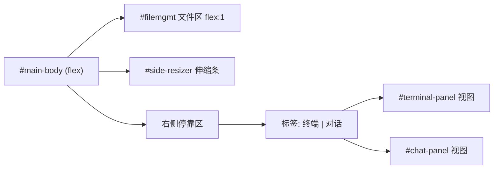
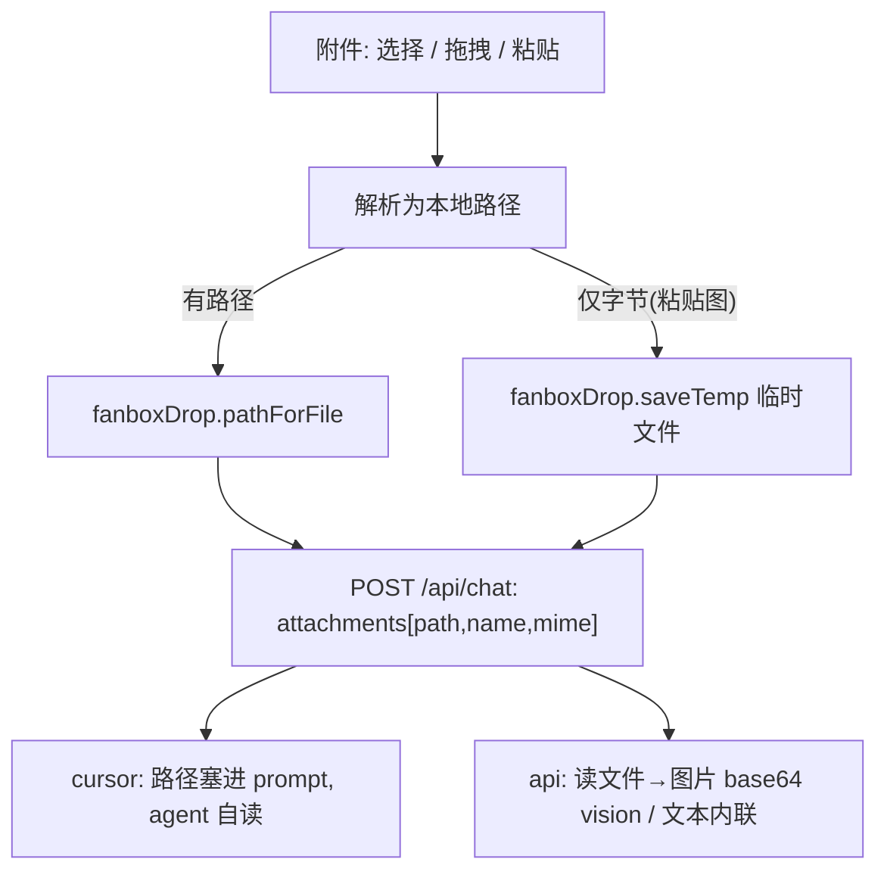

# 嵌入式对话窗 + 供应商预设

三件事：①对话窗从弹出层改为窗口内右侧停靠面板（和「终端」共用停靠区，标签页切换）；②API 设置加「选供应商自动填 URL」；③对话支持文件/图片上传（多模态）。①②主要前端，③前后端都要改。

## 现状回顾

- 对话窗现在是全屏弹层 `#chat-overlay`（`public/index.html`），点击遮罩关闭。用户不想要弹层。
- 右侧停靠区是 `#terminal-panel`，靠 `#main-body` 的 `.dock-right/.dock-bottom` 类 + `#terminal-resizer` 实现伸缩停靠（`public/style.css` 782-831 行），逻辑在 `term` 对象（`public/app.js`）。
- API 设置现在是三个手填输入框（地址/Key/模型），对新手不友好。

## 改动一：对话嵌入右侧停靠区（标签页 终端 / 对话）

复用终端那套停靠机制，让停靠区能放「终端」或「对话」两个视图，只显示其一。

- `public/index.html`：删掉 `#chat-overlay` 弹层；把对话 UI 改成 `#chat-panel` 这个 `<section>`，作为 `#main-body` 里 `#terminal-panel` 的兄弟节点；在两个面板顶部加一条共享标签栏「终端 / 对话」。
- `public/style.css`：给 `#chat-panel` 加和 `#terminal-panel` 对称的停靠样式（`.dock-right #chat-panel` / `.dock-bottom #chat-panel`，`border-left/top` 等）；两个面板同一时刻只 `display` 一个，所以 flex 布局数学不变；保留已有的气泡/输入框样式。加标签栏样式。
- `public/app.js`：
  - `chat.open()` 改为：打开右侧停靠区（复用 `term.open()` 的停靠/尺寸逻辑）、切到「对话」标签、显示 `#chat-panel`、隐藏 `#terminal-panel`。
  - `chat.close()` / 标签切换：在「终端」「对话」两视图间切换 `display`，共用 `#side-resizer` 与 `localStorage` 的宽高记忆。
  - 顶栏「对话」按钮 → 开停靠区并切对话标签；「终端」按钮 → 开停靠区并切终端标签。
  - 对话的发送 / SSE / markdown / 多轮逻辑原样保留，不动。

## 改动二：API 供应商预设（CC-Switch 式）

在 `#chat-settings-panel` 顶部加一个「供应商」下拉。选中即自动填好「API 地址」，并给「模型」一个默认值/候选（`<datalist>` 建议、仍可自由改），用户只需粘贴 Key。选「自定义」则全部手填。

- 预设为 OpenAI 兼容（`/chat/completions`）端点，和现有 API 后端一致。初版品牌（URL 在实现时逐个对官方文档核实后写入）：
  - DeepSeek — `https://api.deepseek.com/v1`（deepseek-chat / deepseek-reasoner）
  - 月之暗面 Kimi — `https://api.moonshot.cn/v1`
  - 智谱 GLM — `https://open.bigmodel.cn/api/paas/v4`
  - 通义千问 / 阿里百炼 — `https://dashscope.aliyuncs.com/compatible-mode/v1`
  - 硅基流动 SiliconFlow — `https://api.siliconflow.cn/v1`
  - 魔搭 ModelScope — `https://api-inference.modelscope.cn/v1`
  - OpenRouter — `https://openrouter.ai/api/v1`
  - MiniMax — 待核实
  - OpenAI 官方 — `https://api.openai.com/v1`
  - 自定义 — 全手填
- 纯前端：选预设只是把值填进现有的地址/模型输入框，仍走原 `/api/chat-config` 保存。可顺带存 `chatApiProvider` 记住上次选择。
- 此项后端不改（API 后端已接受 baseUrl/key/model）。

## 改动三：多模态附件（文件 + 图片上传）

像 Cursor agent 窗口那样，能在对话里上传文件和图片。核心思路：每个附件都先解析成一个本地文件路径，再按后端分别处理。

调研结论：
- Cursor 无头 CLI 不支持直接附图，官方做法是「在 prompt 里写文件路径」，agent 用工具自己读（图片/PDF 等透明处理）——见 Cursor 官方 Headless 文档。
- API（OpenAI 兼容）：图片走 vision 的 base64 `image_url`，文本文件读出来内联。
- preload 已具备能力（`electron/preload.js`）：`fanboxDrop.pathForFile(file)` 取选中/拖入文件的真实路径；`fanboxDrop.saveTemp(name, buf)` 把粘贴/拖入的字节写临时文件换路径。

- 前端（`public/index.html` / `app.js` / `style.css`）：
  - 输入区加「📎 附件」按钮 + 隐藏 `<input type=file multiple>`；支持把文件/图片拖到对话面板、`Ctrl+V` 粘贴剪贴板图片。
  - 选中/拖入文件 → `window.fanboxDrop.pathForFile(file)` 取绝对路径；粘贴的图片 blob / 无路径拖入 → 读 bytes → `fanboxDrop.saveTemp` 拿临时路径。
  - 输入框上方显示附件 chip（图片显缩略图、文件显名字），可单个删除。
  - 发送时在请求体加 `attachments: [{path, name, mime}]`。
- 后端（`public/../server.js` 的 `/api/chat`）：
  - `chatCursor`：把附件路径追加进 prompt 文本（每个一行），交给 agent 自己读。
  - `chatApi`：逐个读文件——图片（按扩展名/mime）→ 转 base64 拼成 `content:[{type:text},{type:image_url,...}]`；文本类（md/txt/json/代码）→ 读文本内联（带文件名标注、限长）；其他二进制 → 提示该后端不支持、建议用 Cursor。
- 浏览器版（非 Electron）拿不到本地路径，多模态仅在桌面 app 生效；网页版附件按钮置灰或提示（边界说明，不投入）。

## 验证

- `node --check` 三个文件。
- 重启 FanBox，确认：① 点「对话」在窗口内右侧出现面板、能和「终端」标签切换、能伸缩；② 设置里选 DeepSeek 等预设后地址自动填好；③ curl 复测 `/api/chat`（cursor）纯文本仍正常；④ curl 带一个图片附件路径测 `/api/chat`（cursor 把路径塞进 prompt，看 agent 是否能读图）。
- 因浏览器自动化在本会话不可用，附件「选择/拖拽/粘贴」的界面交互需你最终点击确认一次。

## 不做（除非你要）

- 不接 Codex（未装 CLI）。
- 不做模型完整目录拉取（用候选 datalist 够用）。
- 不把对话做成中央主体布局（你选了标签页方案）。