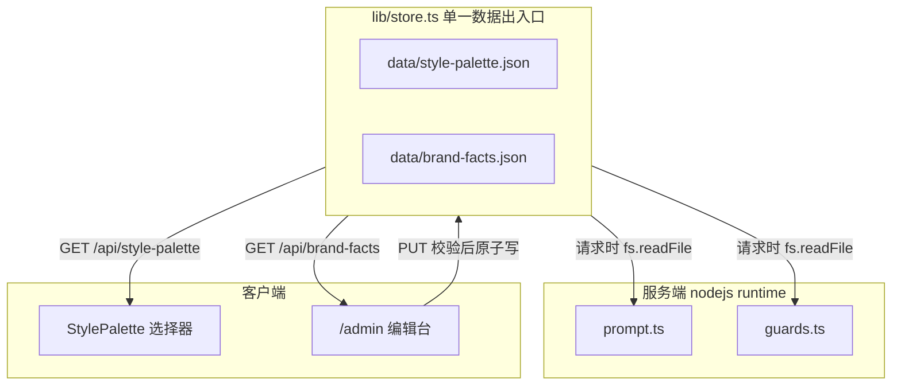

# 文案副驾优化路线图

分档路线图,每档可独立交付,建议 P0 → P3 推进。重点是 P2 的运营自助编辑控制台。标"我的判断"的是取舍建议,非代码缺陷断言。

已确认的取舍:去掉历史结果持久化(价值不大);存储短期写回本机 `data/*.json`,架构为未来"每人账号 + 各自风格库"预留接口。

## 现状(信息生成链路)

纯前端 + 一层薄 API 的 LLM 调用壳:无数据库、无检索。`brand-facts.json` / `style-palette.json` 当前是**构建期静态 import**(见 [lib/prompt.ts](lib/prompt.ts) 第 1-2 行、[lib/guards.ts](lib/guards.ts) 第 1 行),改了文件不重启/不重构建不会生效——这是 P2 的核心障碍。

## P0 对外部署前必须处理(安全 + 成本)

- 给 `/api/polish` 和 `/api/parse` 加最简鉴权或限流。当前是公开端点,任何人可刷 Kimi 额度(专家档 `max_tokens: 8000` 成本高)。最轻量:环境变量配访问口令,前端带 header,服务端校验。这个口令后面 P2 的后台门禁可复用。
- 给 `input` 加长度上限(参照 `background` 已有的 4000 字截断,见 [lib/prompt.ts](lib/prompt.ts) 第 80 行)。
- 给 `/api/parse` 加文件大小上限,避免大 PDF 在 30s `maxDuration` 内超时或 OOM(见 [app/api/parse/route.ts](app/api/parse/route.ts))。

## P1 正确性隐患

- 修编造数字护栏。[lib/guards.ts](lib/guards.ts) 第 15、43 行把整个 `brand-facts.json` 拼进 `sourceText`,导致 `5300/20000000/2` 等数字总被判"安全",护栏近乎失效。改法:匹配源只用"原文 + 用户背景",品牌事实里的数字走单独白名单。
- 让流式错误能透传。[app/api/polish/route.ts](app/api/polish/route.ts) 第 46-60 行模型中途报错时静默关闭流,前端只能给模糊的"请重试"([app/page.tsx](app/page.tsx) 第 139 行)。改法:流中发 `{"error":...}` 帧,前端识别后展示真实原因。

## P2 运营自助编辑控制台(重点功能)

让非技术同学在 UI 里维护风格库与品牌事实,不再手改 JSON。分四步,P2-1 是所有编辑功能的硬地基。

### 关键耦合(动手前必须知道)

风格库/事实层被三处静态 import,其中两处是隐藏地雷:
- [components/StylePalette.tsx](components/StylePalette.tsx) 第 5 行:客户端组件静态 import,读不了 fs,必须改成走 API 取数。
- [lib/prompt.ts](lib/prompt.ts) 第 14 行:`INSPIRATION_IDS` 硬编码了 5 个风格 id;运营删/改这些 id 会让"未选风格"的默认灵感静默失效。
- [lib/guards.ts](lib/guards.ts) 第 4 行:`BANNED` 在模块加载时就算好;改成 fs 读后必须把它挪进函数体,每次请求重算,否则编辑违禁词不生效。

### 读路径(编辑如何流到生成端)

### P2-1 数据层地基(必须先做)

- 新增 `lib/store.ts` 收口全部读写:`getStylePalette / saveStylePalette / getBrandFacts / saveBrandFacts`,签名预留 `userId`(短期忽略)。
- 把三处静态 import 改为运行时读取;服务端每次请求读盘、不在模块顶层缓存;`guards.ts` 的 `BANNED` 挪进函数。
- 写入纪律(两份文件驱动全站生成,写坏影响所有文案):存盘前 schema 校验 → 临时文件 + rename 原子写 → 旧版备份到 `data/backups/<name>.<时间戳>.json` 供回滚。

### P2-2 风格库自助编辑

- 新增 `GET/PUT /api/style-palette`,写入前按 [StyleEntry](lib/types.ts)(第 28 行)校验。
- 后台按 `group` 分组展示,支持增删改,字段 id / name / essence / group。
- `id` 唯一且稳定:新增时由 name 自动生成 slug,冲突追加序号;已存在的 id 不允许改(改 id 等于删旧建新,会留悬空引用)。
- 给条目加 `isDefault` 字段替代 `INSPIRATION_IDS` 硬编码;prompt.ts 改读该字段,运营自己勾选"未选风格时的默认灵感"。

### P2-3 品牌事实上传抽取 + 在线编辑

- 上传文档 → 复用 [/api/parse](app/api/parse/route.ts) 得纯文本。
- 新增 `/api/brand-facts/extract`:prompt 让模型把文本结构化成 brand-facts 形状(brand / positioning / toneCard / products / proofPoints / terminology / compliance);沿用反杜撰纪律,文档没有的字段留空不编。
- 抽取应用方式(已定):**以现有事实为底,只覆盖文档涉及到的字段,其余保留**,统一落进同一张可编辑表单——不丢已有内容,也不做独立 diff UI。
- 在线编辑/空白新建:分区表单,数组项(products / proofPoints / terminology / do / dont / bannedPhrases)可增删行。
- 保存 → `PUT /api/brand-facts` → 校验 + 原子写 + 备份,自动更新 `_meta.lastReviewed`(顺带解决事实层易过期)。

### P2-4 后台门禁与页面

- 新增 `/admin`,含"风格库""品牌事实"两个编辑区。
- 门禁复用 P0 访问口令;`store` 的 `userId` + 会话身份留作长期"账号登录 + 各自风格库"的接口,本期不建账号系统。
- 短期编辑的是单份全局数据:保存后所有用润色工具的人立即共用新版。

## P3 工程可维护性

- 为流式解析状态机([lib/parseStream.ts](lib/parseStream.ts))补单测——全项目最复杂、最易出隐性 bug 处,目前零覆盖。引入轻量框架(如 vitest),把 [scripts/smoke-test.mjs](scripts/smoke-test.mjs) 用例沉淀成可重复回归。
- `/api/warmup` 节流:[app/page.tsx](app/page.tsx) 第 38 行每次加载都发真实请求,用 sessionStorage 限一次。

## 风险与待确认

- 本地 fs 写入仅适用于本机/自有服务器;若哪天上 Serverless(Vercel),`data/*.json` 不可写,需替换为外部存储——`lib/store.ts` 的封装就是为此预留。
- 多人同时写同一份 JSON 有覆盖风险;短期单人用可忽略,长期账号隔离后天然规避。
- 抽取靠模型,质量不稳定;靠"以现有事实为底 + 人工在表单里过一遍"兜底,保存才落盘。
- 待确认:[components/ResultCard.tsx](components/ResultCard.tsx) 未细读(与本功能无关,P3 阶段若做导出/复制再看)。

## 建议起点

我的判断:先做 P2-1(数据层地基)+ P0 口令,这两步是 P2 全部编辑功能的共同地基;之后 P2-2 风格库(改动小、见效快)→ P2-3 品牌事实(最大块)。P1 可并行穿插。确认后我按此展开为带具体 diff 的实施。
