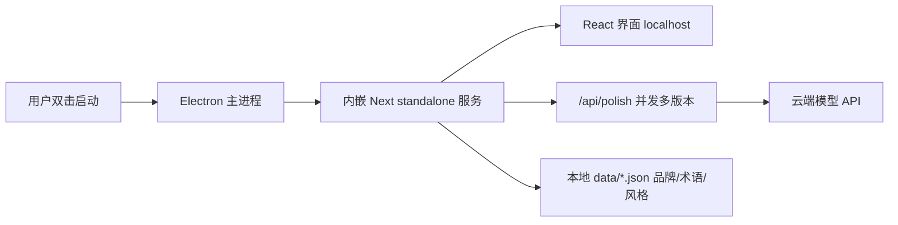

# 本地桌面版「文案美化」工具

## 总判断

不重写。现有 [copywrite 前端](copywrite%20前端) 的提示词、品牌事实层、术语/风格库已经成熟,本次只动三件事:**提速架构、提质环节、桌面打包**。云端模型(够用版保密:只在本机跑、走认可的 API)。

## 架构

## 1. 提速:并发出多版本(最大杠杆)

现状 [lib/llm.ts](copywrite%20前端/lib/llm.ts) 是**一次请求吐含 2–4 版本的大 JSON**,必须等整段写完,标准档 ~20s。

- 改为**并发 N 个请求、每个只写 1 个版本**:第一张卡 5–8s 出,总耗时 = 最慢那条而非相加。
- 单版本输出更短 → 更快;前端 [app/page.tsx](copywrite%20前端/app/page.tsx) 逐卡渲染(流式已具备)。
- 速度由档位决定(见第 3 节):标准档不开 reasoning 走快路。

## 2. 提质:可选「精修」二轮

速度与质量天然冲突,用"先快后精"化解:

- 默认出快版(单轮)。
- 每张卡加「精修」按钮:对该条做第二轮自检润色(对照品牌事实 + 合规 + 术语),只在用户想要时才花这个时间。
- few-shot:接入项目已有的 [scripts/scrape-corpus.ts](copywrite%20前端/scripts/scrape-corpus.ts) 和风格库,给模型更强的范例锚。

## 3. 档位重设:两档共用最强模型,只差 reasoning

按你的定调,简化为两档,**都用同一个最强模型**,差别只在 reasoning:

- **标准版**:最强模型 + 关 reasoning(`temperature 0.6`)→ 快,日常默认。
- **专家版**:最强模型 + 开 reasoning(`temperature 1.0`)→ 慢但质量更高。
- **删掉「深度思考」独立开关**:它已被档位吸收,留着是重复。

落地改动:

- [lib/models.ts](copywrite%20前端/lib/models.ts):`modelForMode` 两档返回同一个 `OPENAI_MODEL`(不再分 normal/pro 两个 slug);档位语义改成 reasoning 开关。
- [lib/llm.ts](copywrite%20前端/lib/llm.ts):`thinking` 与 `temperature` 改由 `mode` 决定,移除 `deepThinking` 分支。
- [lib/types.ts](copywrite%20前端/lib/types.ts)、[route.ts](copywrite%20前端/app/api/polish/route.ts):删 `deepThinking` 字段。
- [app/page.tsx](copywrite%20前端/app/page.tsx):删深度思考 UI,保留标准/专家两档切换。
- 模型保持 provider 无关、env 可换;第 4 节评测只为定这一个「最强模型」。

## 4. 桌面打包:Electron 套 Next standalone

- [next.config.mjs](copywrite%20前端/next.config.mjs) 开 `output: "standalone"`,产出最小自带服务。
- 新建 `electron/` 主进程:启动时 spawn standalone 服务 → `BrowserWindow` 加载 `localhost`。
- 用 `electron-builder` 打成 Windows 安装包/绿色版,双击即用、免装 Node。
- API Key 放主进程资源(不进前端 JS);内部自用够用,安装包内密钥可被提取这点我会注明。
- (更轻量的 Tauri+sidecar 方案存在,但工作量大、要引 Rust,默认走 Electron;你想极致体积再换。)

## 5. 评测:证明"更快更好"

- 选 8–12 条真实文案做固定测试集。
- 记录改造前后:首卡耗时、总耗时、人工质量打分。
- 没有这组对比就只是凭感觉,这步不跳。

## 风险与取舍

- Electron 包体较大(~150MB+),换来零依赖双击运行,内部工具可接受。
- 并发会同时占多个 API 配额,需确认 provider 并发限制。
- "精修"二轮提质但加延迟,故设为按需而非默认。

