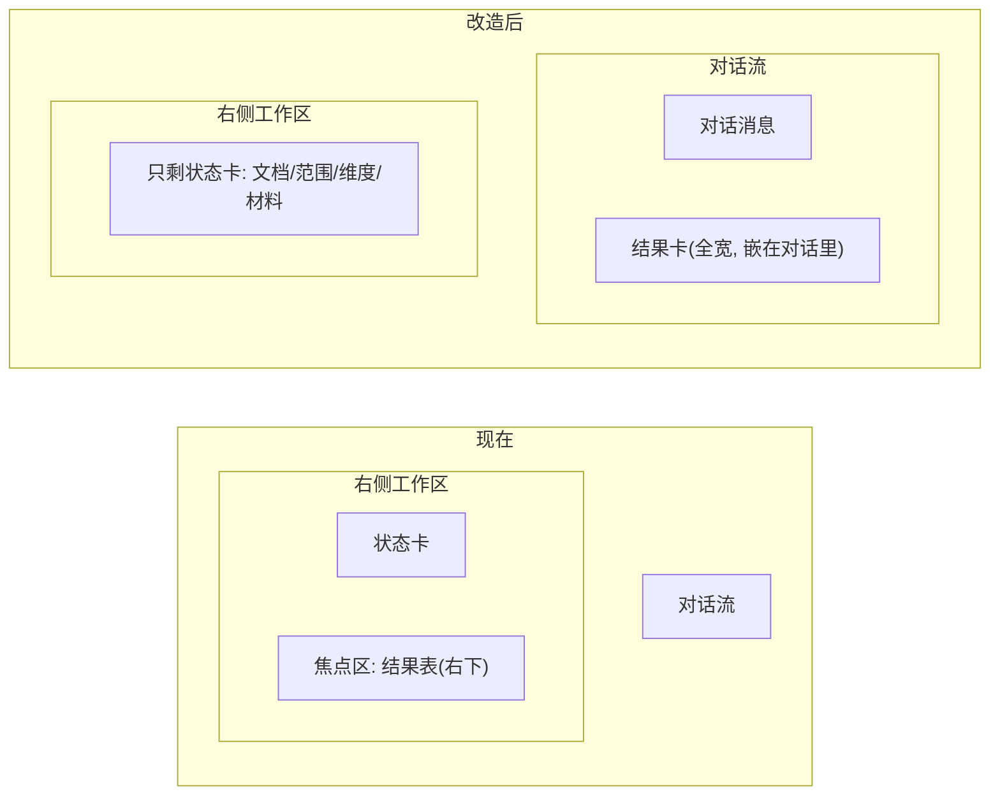

# 校对结果移入对话流

结果是 Agent 的产出,放进对话流"作为回答出现",比藏在右侧配置区下方更符合对话工作台逻辑。右侧工作区回归纯"配置态"。

## 布局变化

## 改动点(集中在前端)

### 1. 移除右侧焦点区
- [ui/index.html](ui/index.html):删掉 `
`,work-pane 只剩 `work-state`。
- [ui/style.css](ui/style.css):`.work-state` 由 `max-height:48%` 改为 `flex:1` 占满工作区;移除 `.work-focus`/`.focus-empty`。

### 2. 结果/加载/错误改走对话流
- [ui/app.js](ui/app.js):
  - `showLoading`:在对话流追加一条 loading 消息(spinner + 进度),存引用以便结果回来时替换。
  - `showError`:对话流加一条错误消息(复用 `addMsg(..., "err")`)。
  - `renderResult`:创建一张"结果卡"(`.msg-result`,全宽,含 summary 条 + 筛选栏 + 九列表 + 导出)追加到对话流。
  - `runProofreadCore`:不再 `openPanel`(结果不在右侧);跑前重置 `S.filter`/`S.sort`。
  - 移除 `renderFocusEmpty` 及 init 调用。

### 3. 多卡作用域(关键)
- 维护 `S._latestResultEl` 指向最新结果卡。
- `renderResult` 创建新卡前先 `freezeOldResults()`:把现存 `.msg-result` 标记 `.frozen`、禁用其筛选/导出控件、表头不可点(事件 handler 内判断 `card === S._latestResultEl` 才响应)。
- `renderRows` 改为在 `S._latestResultEl` 卡内查 `table.result`(不再用全局 `document.querySelector`),筛选/排序控件用卡内 class 选择(不用全局 id,避免多卡 id 冲突)。

### 4. 结果卡样式
- [ui/style.css](ui/style.css):`.msg-result` 占满对话流宽度(突破气泡 `max-width:86%`);`.result-card` 卡片容器;`.frozen` 半透明 + 控件禁用态;loading 消息的内联 spinner。
- 复用现有 `.summary-bar`/`.chip`/`.toolbar`/`.result-table-wrap`/`table.result`/`.sev` 样式不动。

## 保持不变

后端(Agent 编排、校对、materials)完全不动;结果数据结构 `S.result` 不变;九列表渲染逻辑复用,只换挂载位置和作用域。

## 风险

- 旧卡冻结必须彻底:筛选/排序/导出控件都要失效,否则旧卡操作会错乱地动到最新 `S.result`。
- 结果表在对话流要全宽 + 横向滚动:右侧工作区打开时对话变窄,九列表靠 `result-table-wrap` 横向滚动兜底。