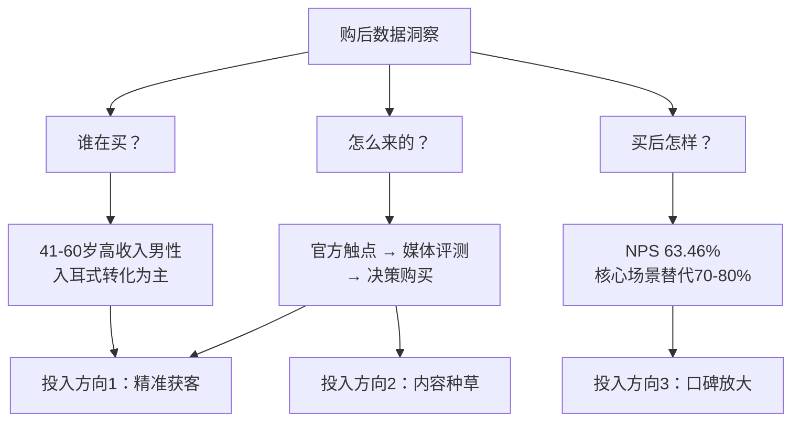

# 补充用户画像 + 营销投入建议

## 改动 1：P5（购买页）补入纯新用户来源数据

在 P5 右侧"购买驱动差异"下方的 insight-box 之前，新增一个 compare-block，内容：

- 整体拉新率 31.92%，纯新 19.81%
- 纯新用户 = 41-60岁高收入，71.8% 在预算内买最好的
- 60-70% 之前用入耳式（品类增量来源）
- 仅 7.8% 买过开耳非耳挂，17.5% 买过开耳耳挂 → 几乎零开耳经验

这回答了"新用户从哪来"，直接为后面的营销投入指向提供弹药。

## 改动 2：P12 升级为营销预算分配建议

替换当前 P12 的"三条路径"框架，改为更具执行力的营销投入矩阵。逻辑链：

新 P12 内容结构（三列布局）：

**列 1：精准获客（建议权重 40-50%）**
- 目标：转化入耳式中年高收入男性
- 数据支撑：拉新率 19.81%，纯新 60-70% 来自入耳
- 打法：
  - 人群定向：41-60岁、$100K+ 收入、科技品类兴趣
  - 核心信息："开放式耳机也能滤噪"（29.37% 第一吸引力）
  - 触点：媒体评测合作（用户研究阶段 Top 1 信息源）

**列 2：内容种草（建议权重 30-35%）**
- 目标：降低购前顾虑，缩短决策链
- 数据支撑：新用户怕嘈杂听不清、无滤噪仅愿付 $167
- 打法：
  - 场景化内容：办公/通话/健身房三个高 NPS 场景真实使用
  - 教育滤噪心智："reduction ≠ cancellation"，管理预期而非过度承诺
  - 渠道：第三方评测 + 电商详情页（用户搜索阶段 Top 1&2 渠道）

**列 3：口碑放大（建议权重 15-20%）**
- 目标：撬动现有高 NPS 用户做裂变
- 数据支撑：NPS 63.46%，推荐第一驱动力=音质，替代率 70-80%
- 打法：
  - 用户证言：聚焦"入耳式被替代"的真实故事
  - 推荐机制：老用户推荐新用户
  - "可以听清外界"进入 Top 3 推荐理由 → 作为社交传播钩子

**底部加一行警示带（红色）：**
- 不建议投入方向：强降噪场景对标（通勤/飞机替代率即使用滤噪也仅 55%）
- 需产品先修复再做营销的：操控体验（不推荐 Top 3 之一，不适合放大声量）
