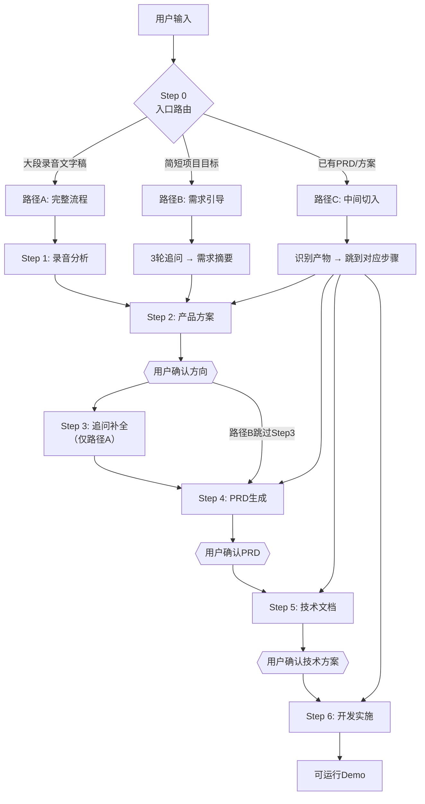

# 产品开发全链路助手

从业务需求到可运行 Demo 的全流程 pipeline，通过 subagent 调度开发团队完成端到端交付。



## 业务上下文

公司/品牌信息存放在 `context/` 目录下，按需读取：

| 公司 | 文件 |
|------|------|
| Shokz | [context/shokz.md](context/shokz.md) |

添加新公司：在 `context/` 下新建文件并在此表格中注册，详见 [context/README.md](context/README.md)。

---

## Step 0: 入口路由

收到用户消息后，**先判断输入类型再决定路径**：

| 判断信号 | 路径 | 起点 |
|---------|------|------|
| 大段口语化文本（篇幅相当于 10 分钟录音） | **A（有录音）** | Step 1 |
| 简短的项目目标、想法或一句话需求 | **B（无录音）** | 需求引导 → Step 2 |
| 附带了 PRD / 产品方案 / 技术文档等中间产物 | **C（中间切入）** | 识别后跳转 |
| 无法判断 | 直接问用户 | — |

无法判断时的话术：
> "你有业务访谈的录音文字稿吗？有的话直接贴过来；没有也没关系，我来引导你把需求理清楚。如果你已经有 PRD 或产品方案，也可以直接给我，我从对应步骤接手。"

### 路径 C 产物识别规则

| 用户提供的产物 | 跳转到 | 说明 |
|--------------|--------|------|
| 录音分析报告 | Step 2 | 跳过 Step 1 |
| 产品方案文档 | Step 4 | 跳过 Step 1-2 |
| PRD | Step 5 | 跳过 Step 1-4 |
| 技术文档（TECH_DESIGN） | Step 6 | 跳过 Step 1-5 |
| 格式不明 / 内容混杂 | 先问用户这份材料对应哪个阶段的产出，确认后再跳转 |

---

## 路径 B: 需求引导

用户没有录音时，通过 3 轮追问补全等价信息，然后从 Step 2 切入。

**第一轮：定位问题域**
- "要解决什么业务问题？能描述一个具体场景吗？"
- "谁会用这个产品？他们现在是怎么做这件事的？"
- "现有做法最大的痛点是什么？"

**第二轮：还原流程与痛点**
- "核心操作步骤大概是什么？从头到尾走一遍？"
- "哪个环节最花时间、最容易出错？"
- "目前在用什么工具或系统处理？"

**第三轮：明确边界**
- "MVP 做到什么程度算可用？必须有什么、明确不做什么？"
- "有没有技术、时间或资源上的硬约束？"
- "做成了用什么标准衡量成功？"

**追问行为准则**：
- 每轮 2-3 个问题，不一次性抛出全部
- 每收集一批信息后主动复述确认
- 用户回答模糊时换策略：场景还原 / 二选一排除 / 反面假设
- 用户说"先给初稿 / 不要问太多"→ 1 轮拿必要约束，直接给骨架版

**追问产出**：输出需求摘要，用户确认后作为 Step 2 输入：

```markdown
## 需求摘要（请确认）

**项目目标**: [一句话]
**目标用户**: [谁在用、什么场景]
**当前做法**: [现在怎么解决的]
**核心痛点**:
1. [痛点 1]
2. [痛点 2]
**MVP 范围**: [必须做 / 明确不做]
**约束条件**: [技术、时间、资源限制]

> 以上理解是否准确？确认后我开始生成产品方案。
```

---

## Step 1: 录音流程分析（仅路径 A）

| 项目 | 内容 |
|------|------|
| **输入** | 用户提供的录音文字稿（完整粘贴或 MD 文件） |
| **Prompt** | 读取 [prompts/step1-interview-analysis.md](prompts/step1-interview-analysis.md) 全文 |
| **组装** | Prompt 全文 + 录音文字稿（完整传入） |
| **执行** | dispatch `generalPurpose` subagent |
| **产出** | `docs/01-录音分析报告.md` |
| **确认点** | 无（直接进入 Step 2） |

---

## Step 2: 产品方案文档

| 项目 | 内容 |
|------|------|
| **输入** | 路径 A：录音文字稿 + 01-录音分析报告（均完整传入）；路径 B：需求摘要（完整传入） |
| **Prompt** | 读取 [prompts/step2-product-solution.md](prompts/step2-product-solution.md) 全文 |
| **组装** | Prompt 全文 + 上述输入材料 |
| **执行** | dispatch `generalPurpose` subagent |
| **产出** | `docs/02-产品方案.md` |
| **确认点** | **必须暂停**，展示方案骨架，等用户确认方向正确后再继续 |

**确认节点格式**：
> 产品方案已生成，核心方向是 [一句话摘要]。包含 [N] 个功能模块：[模块列表]。
> - 回复 **继续** → 进入 PRD 生成
> - 回复 **调整 + 具体意见** → 我修改后重新确认
> - 回复 **重做** → 换个方向重新生成方案

---

## Step 3: 追问补全（仅路径 A）

| 项目 | 内容 |
|------|------|
| **输入** | Step 1 产出的"模糊表述追问清单" |
| **执行** | 将追问清单展示给用户，逐条收集回答 |
| **产出** | 补充信息纳入上下文，传递给 Step 4 |
| **确认点** | 无（用户回答本身就是确认） |

路径 B 跳过此步骤（需求引导阶段已完成等价的信息补全）。

---

## Step 4: PRD 生成

| 项目 | 内容 |
|------|------|
| **输入** | `docs/02-产品方案.md`（完整传入）+ 录音文字稿或需求摘要（摘要传入）+ Step 3 补充信息（如有） |
| **Prompt** | 读取 [prompts/step4-prd-generation.md](prompts/step4-prd-generation.md) 全文 |
| **组装** | Prompt 全文 + 上述输入材料 |
| **执行** | dispatch `generalPurpose` subagent |
| **产出** | `docs/03-PRD.md` |
| **确认点** | **必须暂停**，展示 PRD 摘要，等用户确认后再继续 |

**确认节点格式**：
> PRD 已生成：[产品名称] MVP，包含 [N] 个功能模块，[M] 处标注了【假设】需验证。
> - 回复 **继续** → 进入技术文档生成
> - 回复 **调整 + 具体意见** → 我修改 PRD 后重新确认
> - 回复 **重做** → 重新生成 PRD

---

## Step 5: 技术文档生成

| 项目 | 内容 |
|------|------|
| **输入** | `docs/03-PRD.md`（完整传入） |
| **Prompt** | 读取 [prompts/step5-tech-doc.md](prompts/step5-tech-doc.md) 全文 |
| **组装** | Prompt 全文 + PRD 全文 |
| **执行** | dispatch `generalPurpose` subagent |
| **产出** | `docs/04-TECH_DESIGN.md`、`docs/05-MOCK_SERVICES.md`、`docs/06-ACCEPTANCE.md`、`DEMO_DATA/` |
| **确认点** | **必须暂停**，展示技术选型和模块拆分，等用户确认后再继续 |

**确认节点格式**：
> 技术方案已生成。技术栈：[前端/后端/数据库]。Mock 了 [N] 个外部依赖。
> - 回复 **继续** → 进入开发实施
> - 回复 **调整 + 具体意见** → 我修改技术方案后重新确认

---

## Step 6: 开发实施

| 项目 | 内容 |
|------|------|
| **输入** | `docs/03-PRD.md` + `docs/04-TECH_DESIGN.md` + `docs/05-MOCK_SERVICES.md` |
| **执行** | 按下方任务拆分规则，dispatch 多个角色 subagent |
| **产出** | `src/` 下的可运行代码 + `DEMO_DATA/` |
| **确认点** | 开发完成后展示 Demo 运行方式 |

### 任务拆分规则

1. 读取 PRD 的功能模块列表（第 3 章）和技术文档的模块拆分（TECH_DESIGN）
2. 按功能模块逐个拆分为独立任务，每个任务包含：
   - **角色**：按角色选择决策树（见下方）确定
   - **输入**：PRD 对应章节 + TECH_DESIGN 对应章节
   - **交付**：具体的文件路径（如 `src/backend/api/users.py`）
3. 独立模块并行 dispatch；有依赖关系的模块串行执行

### 角色选择决策树

```
PRD 功能模块
├── 包含 API / 服务端 / 数据库?
│   └── 是 → 后端架构师 (roles/backend-architect.md)
├── 包含用户界面 / 页面?
│   ├── 是 → 前端架构师 (roles/frontend-architect.md)
│   └── 需要设计规范? → + UI/UX 设计师 (roles/ui-ux-designer.md)
├── 包含 AI/ML / 智能分析 / 推荐?
│   └── 是 → AI 集成工程师 (roles/ai-integration-engineer.md)
├── 涉及部署 / CI/CD?
│   └── 是 → DevOps 工程师 (roles/devops-engineer.md)
├── 需要接口测试?
│   └── 是 → API 测试工程师 (roles/api-test-engineer.md)
├── 涉及法律 / 隐私 / 合规?
│   └── 是 → 合规审查员 (roles/compliance-reviewer.md)
└── 有性能要求?
    └── 是 → 性能优化师 (roles/performance-optimizer.md)
```

### Subagent Prompt 组装模板

```
[角色文件的完整内容]

---

## 当前任务

[从 PRD 提取的具体功能模块描述]

## 输入材料

### PRD 相关章节
[PRD 第 3 章对应模块的完整内容]

### 技术设计相关章节
[TECH_DESIGN 对应模块的完整内容]

### Mock 服务信息
[MOCK_SERVICES 中与该模块相关的接口定义]

## 交付要求

- 代码写入 `src/[模块路径]/`
- 遵循 TECH_DESIGN 中的目录结构和技术选型
- Mock 模式下可独立运行
```

---

## 产出目录结构

所有步骤的产出按以下标准目录组织：

```
{project}/
├── docs/
│   ├── 01-录音分析报告.md      ← Step 1 产出
│   ├── 02-产品方案.md          ← Step 2 产出
│   ├── 03-PRD.md              ← Step 4 产出
│   ├── 04-TECH_DESIGN.md      ← Step 5 产出
│   ├── 05-MOCK_SERVICES.md    ← Step 5 产出
│   └── 06-ACCEPTANCE.md       ← Step 5 产出
├── src/                       ← Step 6 代码产出
│   ├── backend/
│   ├── frontend/
│   └── mock-server/
├── DEMO_DATA/                 ← Step 5 产出（演示数据）
│   └── README.md
├── .env                       ← USE_MOCK=true/false
└── README.md                  ← 项目说明 + 启动指引
```

路径 B（无录音）跳过 Step 1，不生成 `01-录音分析报告.md`。
路径 C（中间切入）只生成切入步骤及之后的文件。

---

## 异常处理与恢复

| 异常场景 | 处理方式 |
|---------|---------|
| Subagent 失败或超时 | 重试一次；仍失败则向用户报告原因，提供 prompt 文件路径让用户手动在新对话中执行 |
| 用户说"回到上一步" | 回退到前一步的产出，重新 dispatch 当前步骤 |
| 用户说"重做"或"换个方向" | 保留当前产出为备份（`{filename}.bak.md`），调整策略重新生成 |
| 产出质量不满意但不想重做 | 用户直接编辑产出文件，编辑完成后说"继续"，以编辑后版本作为下一步输入 |
| 路径 B 追问中途用户补充了录音 | 切换到路径 A，已收集的追问信息作为 Step 1 的补充上下文 |
| 路径 C 产物格式不匹配 | 告诉用户期望的格式（对应 prompt 文件中的输出格式），或尝试自动转换后让用户确认 |
| 用户想跳过某个步骤 | 允许跳过，但警告缺失该步骤的产出可能影响后续质量，让用户决定 |

---

## 角色文件索引

| 角色 | 文件 | 调用场景 |
|------|------|---------|
| 合规审查员 | [roles/compliance-reviewer.md](roles/compliance-reviewer.md) | 服务条款、隐私政策、法律合规 |
| 性能优化师 | [roles/performance-optimizer.md](roles/performance-optimizer.md) | 性能测试、瓶颈定位、优化 |
| DevOps 工程师 | [roles/devops-engineer.md](roles/devops-engineer.md) | CI/CD、云基础设施、部署 |
| AI 集成工程师 | [roles/ai-integration-engineer.md](roles/ai-integration-engineer.md) | LLM、推荐、智能自动化 |
| API 测试工程师 | [roles/api-test-engineer.md](roles/api-test-engineer.md) | 接口功能、性能、负载测试 |
| 后端架构师 | [roles/backend-architect.md](roles/backend-architect.md) | API、服务端、数据库 |
| 前端架构师 | [roles/frontend-architect.md](roles/frontend-architect.md) | UI、组件、状态管理 |
| UI/UX 设计师 | [roles/ui-ux-designer.md](roles/ui-ux-designer.md) | 界面设计、设计系统 |
